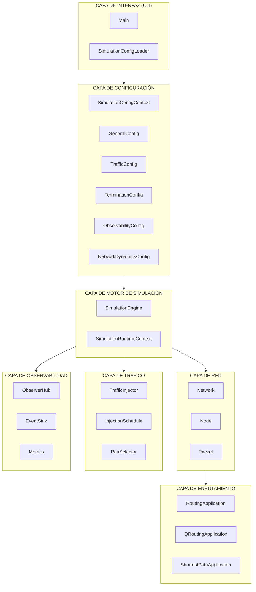
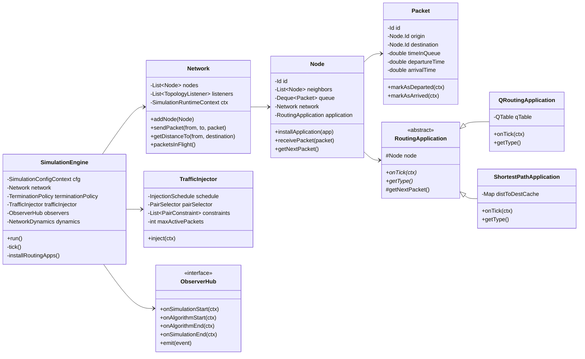
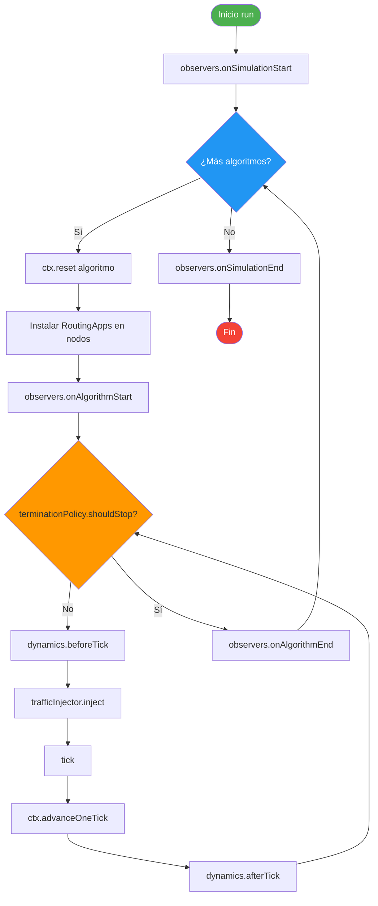
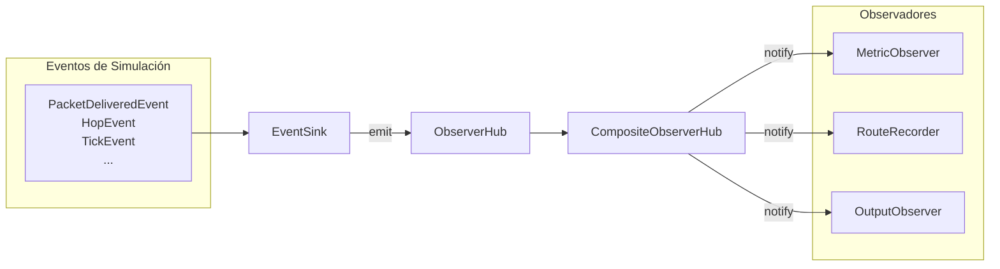
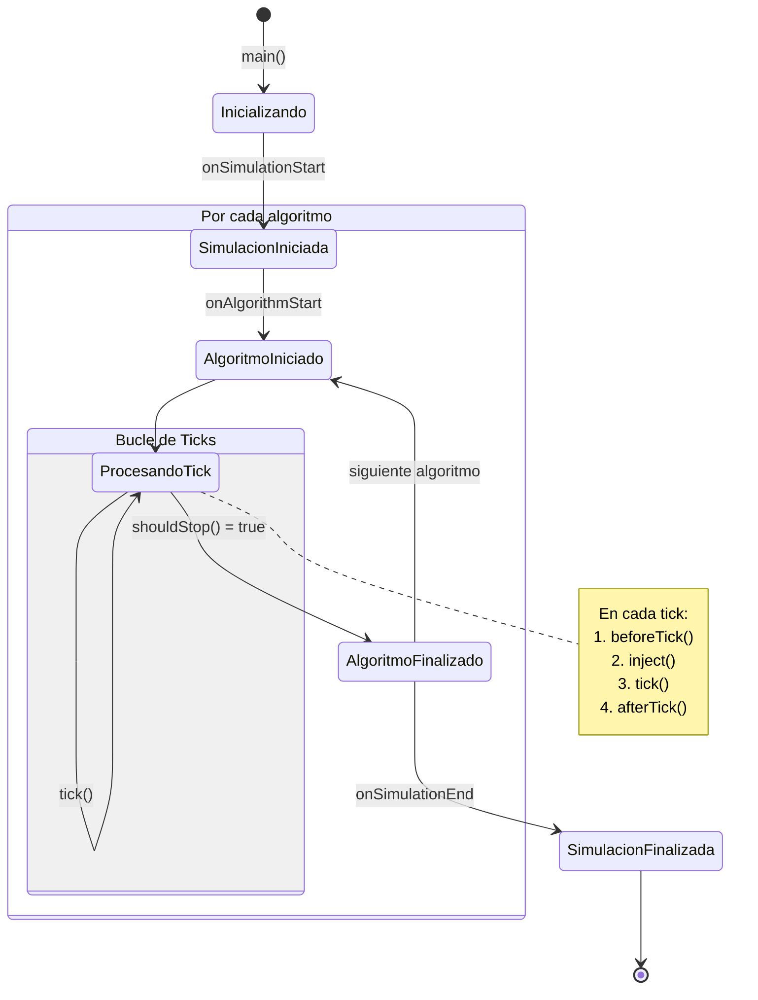
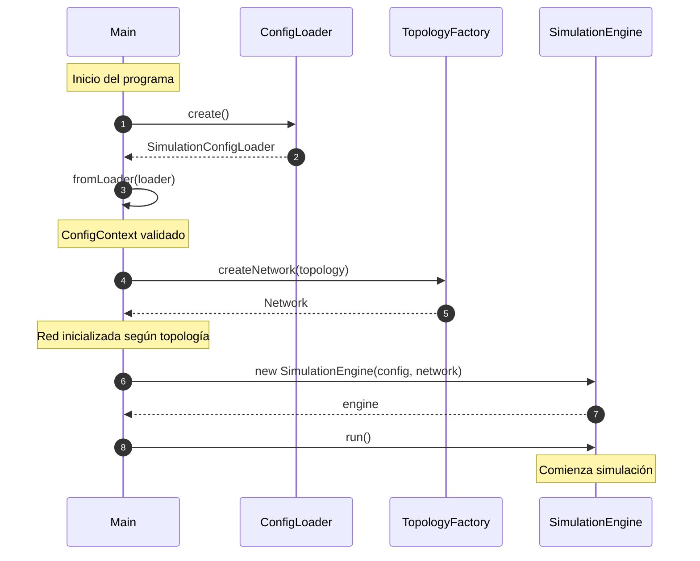
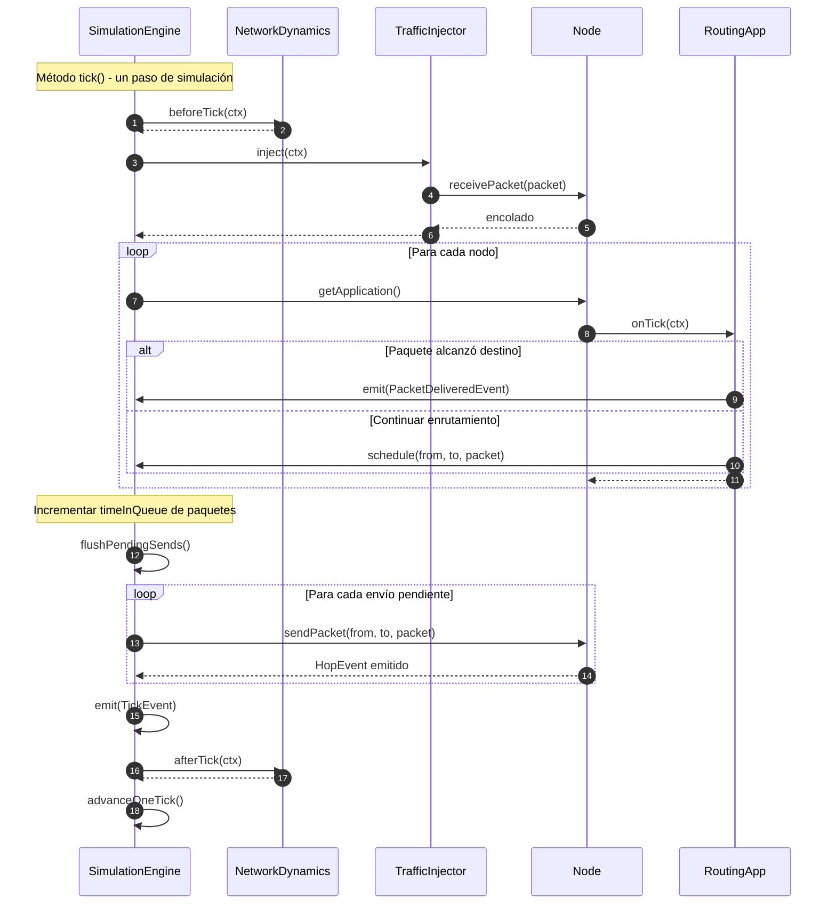
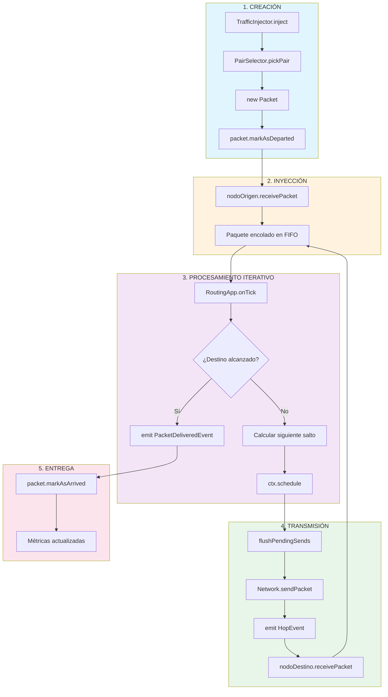

# Descripción Formal de la Arquitectura del MeshRouting Framework

## Resumen

El presente documento describe la arquitectura de software del **MeshRouting Framework**, un sistema de simulación de eventos discretos diseñado para el análisis comparativo de algoritmos de enrutamiento en redes de malla (*mesh networks*). El framework implementa un modelo de simulación basado en ticks temporales que permite evaluar el comportamiento de diferentes estrategias de enrutamiento bajo condiciones controladas de tráfico y topología de red.

---

## 1. Introducción

### 1.1 Contexto y Motivación

El enrutamiento adaptativo en redes de comunicaciones constituye un problema fundamental en la teoría de redes computacionales. La capacidad de un algoritmo de enrutamiento para adaptarse dinámicamente a las condiciones cambiantes de la red —tales como la congestión, los patrones de tráfico variables y las modificaciones topológicas— determina en gran medida la eficiencia global del sistema de comunicaciones.

El MeshRouting Framework surge como respuesta a la necesidad de disponer de un entorno experimental riguroso para la evaluación comparativa de algoritmos de enrutamiento, particularmente aquellos basados en técnicas de aprendizaje por refuerzo como Q-Routing (Boyan & Littman, 1994) frente a algoritmos clásicos basados en el cálculo del camino mínimo.

### 1.2 Objetivos del Sistema

El framework persigue los siguientes objetivos fundamentales:

1. **Reproducibilidad experimental**: Garantizar la replicabilidad de los experimentos mediante el uso de generadores de números pseudoaleatorios deterministas.
2. **Modularidad arquitectónica**: Permitir la incorporación de nuevos algoritmos de enrutamiento, topologías de red y métricas de evaluación sin modificar la estructura nuclear del sistema.
3. **Extensibilidad**: Facilitar la implementación de escenarios experimentales complejos, incluyendo dinámicas de red variables y patrones de tráfico configurables.
4. **Observabilidad**: Proporcionar mecanismos robustos de recolección de métricas y visualización de resultados.

---

## 2. Arquitectura General del Sistema

### 2.1 Vista de Alto Nivel

La arquitectura del MeshRouting Framework se estructura en capas funcionales claramente diferenciadas, siguiendo los principios de diseño de separación de responsabilidades (*Separation of Concerns*) y bajo acoplamiento. El diagrama conceptual de la arquitectura puede representarse como sigue:



### 2.2 Diagrama de Clases Principal



### 2.3 Principios de Diseño Aplicados

El framework implementa varios patrones de diseño de software reconocidos en la literatura:

- **Patrón Factory**: Utilizado extensivamente para la creación de componentes intercambiables (TopologyFactory, RoutingApplicationFactory, TerminationPolicyFactory, ObserverHubFactory).
- **Patrón Strategy**: Aplicado en la implementación de algoritmos de enrutamiento, políticas de terminación y esquemas de inyección de tráfico.
- **Patrón Observer**: Implementado mediante el sistema de observabilidad para el registro y procesamiento de eventos de simulación.
- **Patrón Composite**: Utilizado en CompositeObserverHub para la agregación de múltiples observadores y en políticas de terminación compuestas.

---

## 3. Componentes Principales

### 3.1 Capa de Interfaz de Línea de Comandos (CLI)

#### 3.1.1 Clase `Main`

La clase `Main` constituye el punto de entrada del sistema y orquesta la secuencia de inicialización:

```java
public class Main {
    public static void main(String[] args) {
        var loader = ConfigFactory.create(SimulationConfigLoader.class);
        var configCtx = SimulationConfigContext.fromLoader(loader);
        var network = TopologyFactory.createNetwork(configCtx.general().topology());
        new SimulationEngine(configCtx, network).run();
    }
}
```

El flujo de inicialización comprende:
1. **Carga de configuración**: Instanciación del `SimulationConfigLoader` mediante la librería Owner.
2. **Construcción del contexto**: Transformación de los parámetros crudos en un `SimulationConfigContext` validado.
3. **Creación de la topología**: Delegación a `TopologyFactory` para la construcción de la estructura de red.
4. **Ejecución de la simulación**: Instanciación y ejecución del motor de simulación.

#### 3.1.2 Interfaz `SimulationConfigLoader`

Esta interfaz, anotada con `@Config.Sources`, define el contrato para la lectura de parámetros de configuración desde el archivo `application.properties`. Utiliza el framework Owner para el mapeo automático de propiedades a métodos de acceso tipados.

### 3.2 Capa de Configuración

#### 3.2.1 Record `SimulationConfigContext`

El `SimulationConfigContext` actúa como contenedor inmutable de la configuración validada de la simulación. Se estructura como un *record* de Java que encapsula cinco sub-configuraciones:

```java
public record SimulationConfigContext(
    GeneralConfig general,
    TerminationConfig termination,
    TrafficConfig traffic,
    NetworkDynamicsConfig dynamics,
    ObservabilityConfig observability
) { ... }
```

La separación en sub-configuraciones permite una gestión modular de los diferentes aspectos del experimento.

#### 3.2.2 Configuraciones Especializadas

| Configuración | Responsabilidad |
|---------------|-----------------|
| `GeneralConfig` | Parámetros globales: semilla, topología, algoritmos, límites de paquetes |
| `TerminationConfig` | Políticas de finalización de la simulación |
| `TrafficConfig` | Esquemas de inyección y selección de pares origen-destino |
| `NetworkDynamicsConfig` | Dinámicas de red (fallos, movilidad) |
| `ObservabilityConfig` | Métricas y salidas a generar |

### 3.3 Capa del Motor de Simulación

#### 3.3.1 Clase `SimulationEngine`

El `SimulationEngine` implementa el núcleo del sistema de simulación de eventos discretos. Su diseño sigue el paradigma de simulación síncrona basada en ticks, donde cada tick representa una unidad discreta de tiempo de simulación.

**Atributos principales:**

```java
public final class SimulationEngine {
    private final SimulationConfigContext cfg;
    private final Network network;
    private final TerminationPolicy terminationPolicy;
    private final TrafficInjector trafficInjector;
    private final ObserverHub observers;
    private final NetworkDynamics dynamics;
}
```

**Algoritmo de ejecución principal:**

El método `run()` implementa el bucle principal de simulación con la siguiente estructura:



**Pseudocódigo equivalente:**

```
PARA CADA algoritmo EN algoritmos_configurados:
    1. Reiniciar contexto de ejecución
    2. Instalar aplicaciones de enrutamiento en cada nodo
    3. Notificar inicio de experimento a observadores
    4. MIENTRAS NO política_terminación.debeFinalizar():
        a. Ejecutar dinámicas pre-tick
        b. Inyectar tráfico según esquema configurado
        c. Procesar tick de simulación
        d. Avanzar contador temporal
        e. Ejecutar dinámicas post-tick
    5. Notificar fin de experimento a observadores
6. Notificar fin de simulación
```

#### 3.3.2 Método `tick()`

El método `tick()` constituye el corazón del ciclo de simulación y ejecuta la siguiente secuencia:

1. **Procesamiento de nodos**: Invocación del método `onTick()` de cada aplicación de enrutamiento instalada en los nodos de la red.
2. **Actualización de tiempos en cola**: Incremento del contador `timeInQueue` para cada paquete en espera.
3. **Resolución de envíos pendientes**: Flush del buffer de envíos programados durante el tick actual.
4. **Ejecución de transferencias**: Envío efectivo de paquetes entre nodos vecinos.
5. **Emisión de eventos**: Generación de `TickEvent` para el sistema de observabilidad.

Este diseño implementa un modelo de **actualización sincrónica en dos fases**, donde primero se toman todas las decisiones de enrutamiento y posteriormente se ejecutan las transferencias, evitando así condiciones de carrera y garantizando determinismo.

#### 3.3.3 Clase `SimulationRuntimeContext`

El `SimulationRuntimeContext` mantiene el estado mutable de la simulación durante su ejecución:

```java
public final class SimulationRuntimeContext {
    private double tick;                          // Tiempo actual de simulación
    private DeterministicRng rng;                 // Generador aleatorio determinista
    private AlgorithmType currentAlgorithm;       // Algoritmo en evaluación
    private List<Packet> deliveredPackets;        // Paquetes entregados
    private List<PendingSend> pendingSends;       // Buffer de envíos pendientes
    private EventSink eventSink;                  // Canal de eventos
}
```

El método `schedule(from, to, packet)` permite a las aplicaciones de enrutamiento programar el envío de un paquete para el final del tick actual, implementando el mecanismo de actualización en dos fases.

### 3.4 Capa de Red

#### 3.4.1 Clase `Network`

La clase `Network` representa la topología de red como un grafo no dirigido de nodos interconectados:

```java
public class Network {
    private final List<Node> nodes;
    private final List<TopologyListener> listeners;
    private SimulationRuntimeContext ctx;
}
```

**Operaciones principales:**

- `addNode(Node)`: Incorporación de nodos con notificación a listeners.
- `sendPacket(from, to, packet)`: Transferencia de paquetes entre nodos adyacentes con emisión de `HopEvent`.
- `getDistanceTo(from, destination)`: Cálculo de distancia mediante BFS.
- `packetsInFlight()`: Conteo de paquetes en tránsito en la red.

#### 3.4.2 Clase `Node`

Cada nodo de la red encapsula:

```java
public class Node {
    private final Node.Id id;                    // Identificador único
    private final List<Node> neighbors;          // Vecinos adyacentes
    private final Deque<Packet> queue;           // Cola de paquetes FIFO
    private final Network network;               // Referencia a la red contenedora
    private RoutingApplication application;      // Aplicación de enrutamiento instalada
}
```

El modelo de cola FIFO (*First-In-First-Out*) implementa el comportamiento clásico de buffers de red, donde los paquetes se procesan en orden de llegada.

#### 3.4.3 Clase `Packet`

La entidad `Packet` representa la unidad de transmisión en la red:

```java
public class Packet {
    private final Id id;                  // Identificador único del paquete
    private final Node.Id origin;         // Nodo origen
    private final Node.Id destination;    // Nodo destino
    private double timeInQueue;           // Tiempo acumulado en colas
    private double departureTime;         // Instante de inyección
    private double arrivalTime;           // Instante de entrega
}
```

### 3.5 Capa de Enrutamiento

#### 3.5.1 Clase Abstracta `RoutingApplication`

La clase abstracta `RoutingApplication` define el contrato para las implementaciones de algoritmos de enrutamiento:

```java
public abstract class RoutingApplication {
    private final Node node;
    
    public abstract void onTick(SimulationRuntimeContext ctx);
    public abstract AlgorithmType getType();
    protected Optional<Packet> getNextPacket();
}
```

El método `onTick()` constituye el punto de extensión principal, invocado por el motor de simulación en cada tick para que la aplicación procese el siguiente paquete en cola.

#### 3.5.2 Implementación `QRoutingApplication`

La implementación de Q-Routing sigue el algoritmo propuesto por Boyan y Littman (1994), basado en aprendizaje por diferencias temporales:

**Estructura de la Q-Table:**

La tabla Q almacena estimaciones del tiempo de entrega para cada combinación (nodo_actual, siguiente_salto, destino):

```
Q(x, y, d) = Tiempo estimado de entrega desde x vía y hacia d
```

**Actualización temporal-diferencial:**

```
Q(x, y, d) ← Q(x, y, d) + η · [(q + s + t) - Q(x, y, d)]
```

Donde:
- `η = 0.5`: Tasa de aprendizaje
- `q`: Tiempo en cola del paquete
- `s = 1.0`: Tiempo de transmisión (constante)
- `t = min_z Q(y, z, d)`: Mejor estimación del siguiente nodo

**Selección de siguiente salto:**

El algoritmo selecciona el vecino con menor Q-valor estimado, implementando una política greedy con desempate aleatorio.

#### 3.5.3 Implementación `ShortestPathApplication`

La implementación de camino mínimo calcula las rutas óptimas mediante búsqueda en anchura (BFS), aprovechando la asunción de tiempos de transmisión uniformes:

```java
private Map<Node.Id, Integer> computeDistancesToDestination(Node.Id destination) {
    // BFS desde el destino para calcular distancias
    Map<Node.Id, Integer> dist = new HashMap<>();
    Queue<Node.Id> queue = new ArrayDeque<>();
    dist.put(destination, 0);
    queue.add(destination);
    // ... propagación BFS
}
```

La implementación utiliza caché con invalidación (*dirty flag*) para optimizar el recálculo ante cambios topológicos.

### 3.6 Capa de Tráfico

#### 3.6.1 Clase `TrafficInjector`

El `TrafficInjector` coordina la inyección de paquetes en la red:

```java
public final class TrafficInjector {
    private final InjectionSchedule schedule;        // Cuántos paquetes inyectar
    private final PairSelector pairSelector;         // Dónde inyectar (origen-destino)
    private final List<PairConstraint> constraints;  // Restricciones de pares
    private final int maxActivePackets;              // Límite de backpressure
}
```

El método `inject()` implementa el siguiente algoritmo:

```
1. Consultar schedule.packetsToInject(ctx)
2. Aplicar límite de backpressure
3. PARA i = 1 HASTA injectCount:
   a. Seleccionar par origen-destino
   b. Verificar restricciones
   c. Crear paquete y encolarlo en nodo origen
```

#### 3.6.2 Interfaz `InjectionSchedule`

Define la estrategia de volumen de inyección temporal:

```java
public interface InjectionSchedule {
    int packetsToInject(SimulationRuntimeContext ctx);
}
```

**Implementaciones disponibles:**

| Estrategia | Descripción |
|------------|-------------|
| `LoadLevelSchedulePreset` | Carga promedio L por tick (permite L > 1.0) |
| `ProbPerTickSchedulePreset` | Inyección Bernoulli con probabilidad p |
| `GapSchedulePreset` | Lotes cada N ticks |
| `LinearLoadSchedulePreset` | Carga incremental lineal |
| `TriangularLoadSchedulePreset` | Carga triangular periódica |
| `PlateauRampPlateauSchedulePreset` | Perfil meseta-rampa-meseta |

#### 3.6.3 Interfaz `PairSelector`

Define la estrategia de selección de pares origen-destino:

```java
public interface PairSelector {
    NodePair pickPair(SimulationRuntimeContext ctx);
}
```

**Implementaciones disponibles:**

- `RandomPairSelectorPreset`: Selección uniforme aleatoria
- `RandomInGroupsPairSelectorPreset`: Selección dentro de grupos definidos
- `OscillatingBetweenGroupsPairSelectorPreset`: Alternancia direccional entre grupos

### 3.7 Capa de Topología

#### 3.7.1 Interfaz `TopologyPreset`

Define el contrato para la creación de topologías de red:

```java
public interface TopologyPreset {
    TopologyType type();
    Network createNetwork();
}
```

#### 3.7.2 Implementación `Grid6x6Preset`

Crea una malla irregular de 6×6 nodos (36 nodos totales) con algunas conexiones eliminadas para introducir asimetría:

```java
// Conectar vecinos en grilla regular
for (int i = 0; i < 36; i++) {
    int row = i / 6;
    int col = i % 6;
    if (col < 5) connect(nodes, i, i + 1);  // Horizontal
    if (row < 5) connect(nodes, i, i + 6);  // Vertical
}
// Eliminar conexiones específicas para crear "agujeros"
remove(nodes, 8, 9);   // Crear irregularidad
remove(nodes, 1, 7);   // ...
```

### 3.8 Capa de Observabilidad

#### 3.8.1 Arquitectura del Sistema de Eventos

El sistema de observabilidad implementa el patrón Observer con desacoplamiento mediante eventos tipados:



#### 3.8.2 Interfaz `ObserverHub`

```java
public interface ObserverHub extends EventSink {
    void onSimulationStart(SimulationRuntimeContext ctx);
    void onAlgorithmStart(SimulationRuntimeContext ctx);
    void onAlgorithmEnd(SimulationRuntimeContext ctx);
    void onSimulationEnd(SimulationRuntimeContext ctx);
}
```

#### 3.8.3 Eventos de Simulación

| Evento | Información | Momento de emisión |
|--------|-------------|-------------------|
| `PacketDepartedEvent` | Paquete, origen, tick | Inyección de paquete |
| `HopEvent` | Paquete, from, to, tick | Transmisión entre nodos |
| `PacketDeliveredEvent` | Paquete, hops, tick | Entrega en destino |
| `TickEvent` | Tick, paquetes en vuelo | Final de cada tick |
| `LoadLevelUpdatedEvent` | Nivel de carga actual | Cambio de carga |

#### 3.8.4 Sistema de Métricas

El framework implementa un sistema extensible de métricas mediante el patrón Preset:

```java
public interface MetricPreset<T> {
    MetricType type();
    MetricBundle<T> createBundle(SimulationConfigContext cfg, Network network);
}
```

**Métricas implementadas:**

1. **AVG_DELIVERY_TIME**: Tiempo promedio de entrega de paquetes
2. **AVG_DELIVERY_TIME_VS_LOAD_LEVEL**: Tiempo promedio vs. nivel de carga
3. **AVG_DELIVERY_TIME_VS_LOAD_VS_TICK**: Evolución temporal tridimensional

### 3.9 Capa de Terminación

#### 3.9.1 Interfaz `TerminationPolicy`

```java
public interface TerminationPolicy {
    boolean shouldStop(SimulationRuntimeContext ctx);
}
```

**Políticas disponibles:**

- `FixedTicksTerminationPreset`: Finalización tras N ticks
- `TotalPacketsDeliveredTerminationPreset`: Finalización tras N entregas
- `CompositeTerminationPreset`: Combinación OR/AND de políticas

### 3.10 Capa de Dinámicas de Red

#### 3.10.1 Interfaz `NetworkDynamics`

```java
public interface NetworkDynamics {
    default void beforeTick(SimulationRuntimeContext ctx) {}
    default void afterTick(SimulationRuntimeContext ctx) {}
}
```

Esta interfaz proporciona puntos de extensión para implementar dinámicas de red como:
- Fallos de nodos/enlaces
- Movilidad de nodos
- Variaciones en latencia de enlaces

---

## 4. Flujo de Datos

### 4.0 Diagrama de Estados de la Simulación



### 4.1 Diagrama de Secuencia: Inicialización



### 4.2 Diagrama de Secuencia: Ciclo de Tick



### 4.3 Flujo de Procesamiento de Paquetes

El ciclo de vida de un paquete en el sistema sigue la siguiente secuencia:



**Descripción detallada del ciclo:**

1. **Creación**: `TrafficInjector` genera el paquete con origen y destino.
2. **Inyección**: El paquete se encola en el nodo origen.
3. **Procesamiento iterativo**:
   - La aplicación de enrutamiento del nodo actual extrae el paquete de la cola.
   - Se determina el siguiente salto según el algoritmo implementado.
   - Se programa el envío mediante `ctx.schedule()`.
4. **Transmisión**: Al finalizar el tick, los envíos pendientes se ejecutan.
5. **Entrega**: Cuando el paquete alcanza su destino, se emite `PacketDeliveredEvent`.

---

## 5. Extensibilidad del Framework

### 5.1 Incorporación de Nuevos Algoritmos de Enrutamiento

Para añadir un nuevo algoritmo de enrutamiento:

1. Crear una clase que extienda `RoutingApplication`.
2. Implementar `onTick()` con la lógica de enrutamiento.
3. Añadir el tipo correspondiente a `AlgorithmType`.
4. Crear un `RoutingApplicationPreset` y registrarlo en `RoutingApplicationFactory`.

### 5.2 Incorporación de Nuevas Topologías

1. Implementar la interfaz `TopologyPreset`.
2. Añadir el tipo correspondiente a `TopologyType`.
3. Registrar el preset en `TopologyFactory`.

### 5.3 Incorporación de Nuevas Métricas

1. Implementar `Metric<T>` con la lógica de agregación.
2. Crear `MetricRenderer<T>` y `ComparisonRenderer<T>`.
3. Crear `MetricPreset<T>` que ensamble los componentes.
4. Registrar en `ObserverHubFactory`.

---

## 6. Consideraciones de Implementación

### 6.1 Determinismo

El framework garantiza determinismo mediante:
- `DeterministicRng`: Generador de números pseudoaleatorios con semilla configurable.
- Ordenación estable de nodos y vecinos por identificador.
- Procesamiento secuencial dentro de cada tick.

### 6.2 Modelo de Tiempo

El sistema implementa un modelo de tiempo discreto donde:
- Cada tick representa una unidad temporal indivisible.
- El tiempo de transmisión entre nodos adyacentes es constante (1 tick).
- El tiempo de procesamiento en cola se acumula como métrica de congestión.

### 6.3 Modelo de Comunicación

La comunicación entre nodos sigue un modelo de paso de mensajes síncrono:
- Los envíos se programan durante el tick actual.
- Las transmisiones se ejecutan al finalizar el tick.
- La recepción ocurre al inicio del tick siguiente.

---

## 7. Conclusiones

El MeshRouting Framework constituye una plataforma de simulación robusta y extensible para la evaluación comparativa de algoritmos de enrutamiento en redes de malla. Su arquitectura modular, basada en patrones de diseño reconocidos, facilita la incorporación de nuevas funcionalidades sin comprometer la integridad del sistema.

Los aspectos destacables de la arquitectura incluyen:

1. **Separación clara de responsabilidades** entre capas funcionales.
2. **Extensibilidad mediante el patrón Factory/Preset** para componentes intercambiables.
3. **Sistema de observabilidad desacoplado** mediante eventos tipados.
4. **Garantías de reproducibilidad** mediante generación aleatoria determinista.
5. **Configurabilidad exhaustiva** mediante sistema de propiedades con validación.

El diseño del motor de simulación, con su modelo de actualización en dos fases, garantiza la consistencia y el determinismo necesarios para la validez de los experimentos comparativos.

---

## Referencias

- Boyan, J. A., & Littman, M. L. (1994). Packet Routing in Dynamically Changing Networks: A Reinforcement Learning Approach. *Advances in Neural Information Processing Systems*, 6.
- Gamma, E., Helm, R., Johnson, R., & Vlissides, J. (1994). *Design Patterns: Elements of Reusable Object-Oriented Software*. Addison-Wesley.
- Tanenbaum, A. S., & Wetherall, D. J. (2011). *Computer Networks* (5th ed.). Pearson.

---

## Apéndice A: Estructura de Paquetes

```
org.ungs
├── cli
│   ├── Main.java
│   └── SimulationConfigLoader.java
├── core
│   ├── config
│   │   ├── GeneralConfig.java
│   │   ├── GroupsConfig.java
│   │   ├── InjectionScheduleConfig.java
│   │   ├── NetworkDynamicsConfig.java
│   │   ├── ObservabilityConfig.java
│   │   ├── PairConstraintsConfig.java
│   │   ├── PairSelectionConfig.java
│   │   ├── SimulationConfigContext.java
│   │   ├── TerminationConfig.java
│   │   └── TrafficConfig.java
│   ├── dynamics
│   │   ├── api/
│   │   ├── factory/
│   │   └── presets/
│   ├── engine
│   │   ├── SimulationEngine.java
│   │   └── SimulationRuntimeContext.java
│   ├── network
│   │   ├── Network.java
│   │   ├── Node.java
│   │   └── Packet.java
│   ├── observability
│   │   ├── api/
│   │   ├── events/
│   │   ├── factory/
│   │   ├── metrics/
│   │   ├── output/
│   │   └── route/
│   ├── routing
│   │   ├── api/
│   │   ├── factory/
│   │   ├── impl/
│   │   └── presets/
│   ├── termination
│   │   ├── api/
│   │   ├── factory/
│   │   └── presets/
│   ├── topology
│   │   ├── api/
│   │   ├── factory/
│   │   └── presets/
│   └── traffic
│       ├── pairs/
│       ├── runtime/
│       └── schedule/
└── util
    ├── DeterministicRng.java
    ├── FileUtils.java
    ├── Tuple.java
    └── Tuple3.java
```

---

*Documento generado para propósitos académicos. Universidad Nacional de General Sarmiento.*
- Topología de red (6x6 irregular grid, 7 hypercube, 116-node LATA telephone network, etc).
- Algoritmos de routing a comparar (Q-Routing, Shortest-Path, etc).
- Cantidad de paquetes a enviar.
- Tiempo entre cada paquete.
- Métricas a medir.
- Generación de gráficos (sí/no, cuáles).

Estos parámetros se pueden pasar por línea de comandos o por un archivo de configuración, y se van a encapsular en un record SimulationConfig para facilitar su manejo.

## Simulation
- Inicializa la topología de red, los nodos y los enlaces según la configuración recibida.
- Crea los paquetes y los envía a la red según los parámetros de tiempo especificados, por cada algoritmo de routing a comparar.
- Implementa el sistema de ticks para simular el paso del tiempo en la red, procesando los eventos en cada tick (envío y recepción de paquetes, actualización de colas, etc). Esto nos previene de usar hilos y facilita la simulación.

## Registry
- Lleva un registro de todos los eventos que ocurren en la simulación (envío y recepción de paquetes, tiempos de entrega, estados de las colas, etc).
- Proporciona métodos para consultar estos datos y calcular las métricas solicitadas.
- Se llama desde partes relevantes del código para registrar eventos.
- Implementa un singleton para asegurar que todas las partes del código acceden al mismo registro.

## Metrics
- Define una interfaz para las métricas a medir (tiempo promedio de entrega, throughput, etc).
- Implementa las métricas solicitadas en la configuración.
- Proporciona métodos para calcular y devolver los resultados de las métricas basándose en los datos del Registry.

## GraphGenerator
- Toma los resultados de las métricas y genera gráficos comparativos.
- Utiliza una biblioteca de gráficos para crear visualizaciones claras y comparativas entre los algoritmos

## Network
- Representa la topología de red, incluyendo nodos y enlaces.
- Proporciona métodos para enviar paquetes entre nodos.

## Node
- Representa un nodo en la red.
- Mantiene una cola de paquetes a procesar.
- Tiene una aplicación que implementa el algoritmo de routing asignado (Q-Routing, Shortest-Path, etc).
- Proporciona interfaces para recibir paquetes, procesarlos y enviarlos al siguiente nodo, que van a ser implementadas por las aplicaciones de routing.

## Application
- Define una interfaz para las aplicaciones de routing.
- Implementa los métodos necesarios para procesar paquetes y decidir el siguiente salto basado en el algoritmo de routing.

## QRoutingApplication
- Implementa el algoritmo Q-Routing.
- Mantiene una tabla Q para tomar decisiones de routing.
- Actualiza la tabla Q basándose en las recompensas recibidas por la entrega de paquetes
- Implementa la lógica para seleccionar el siguiente salto basándose en la tabla Q.

## ShortestPathApplication
- Implementa el algoritmo Shortest-Path (Dijkstra).
- Calcula las rutas más cortas desde el nodo a todos los demás nodos en la red.
- Selecciona el siguiente salto basándose en las rutas calculadas.

# Cosas para extender a futuro
- Implementar más algoritmos de routing.
- Incluir más condiciones de red, como enlaces que se desconectan o tiempos de transmisión variables.
- Agregar más métricas para evaluar el rendimiento de los algoritmos.
- Agregar estrategias de envío de paquetes incrementales (gaps variables) o basadas en patrones de tráfico específicos (origen y destino variables).
- Agregar cálculo de latencia de envío entre nodos basados en distancias (habría que agregar time in flight a los paquetes, ya no sería 1 por tick).
- Agregar variaciones en la posición de los nodos en la topología (por ejemplo, nodos móviles).
- Agregar un tiempo máximo o hops máximos para la entrega de paquetes, para evitar que queden "perdidos" en la red indefinidamente.
