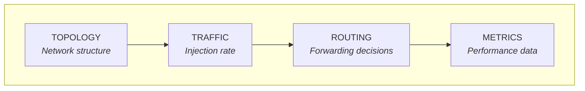
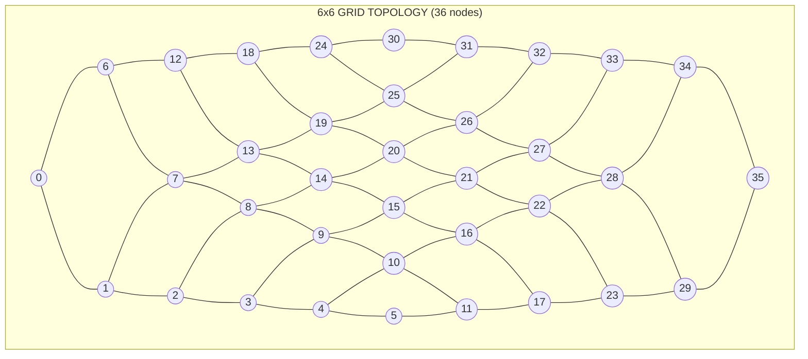
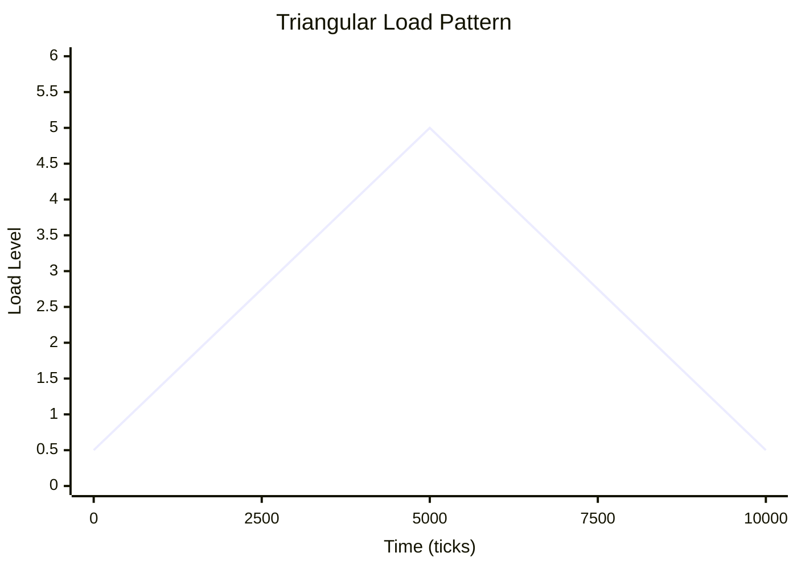
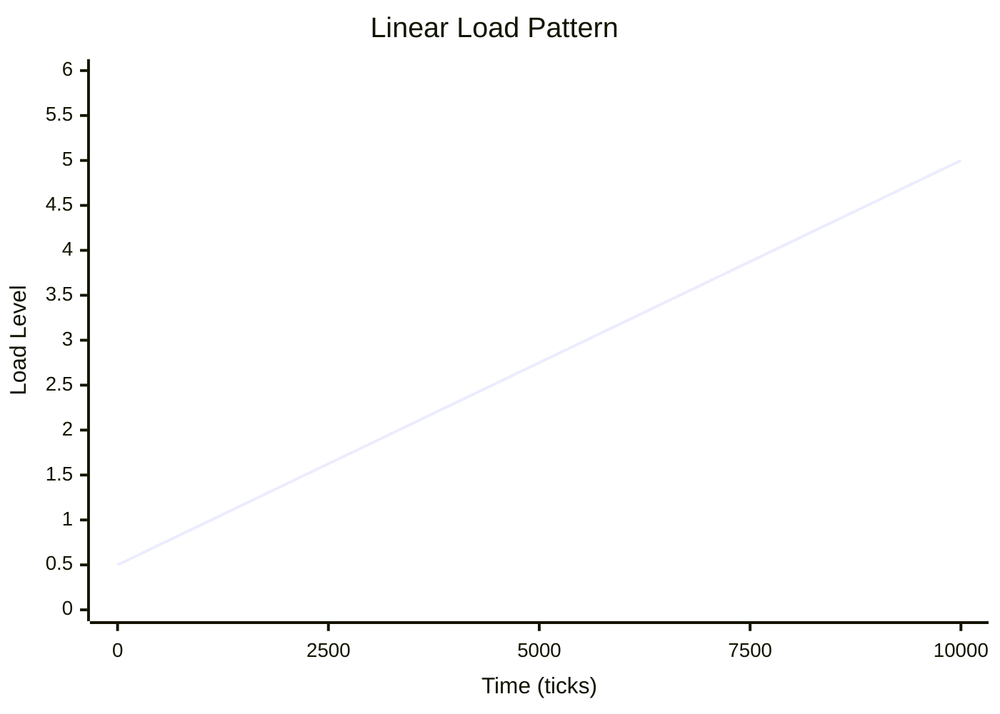
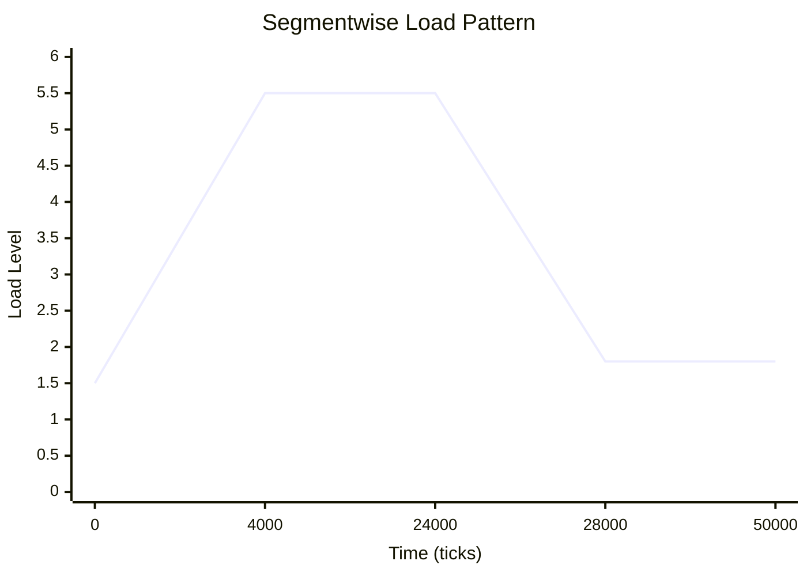
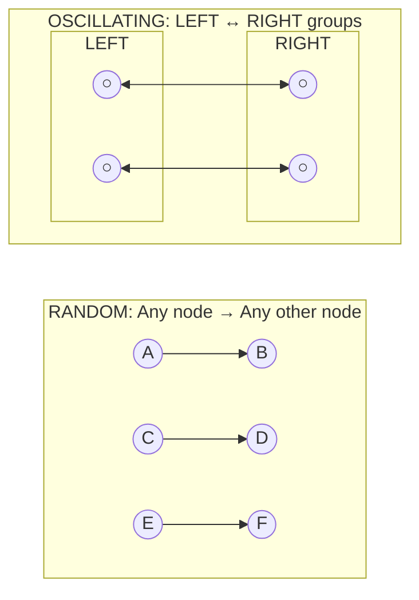
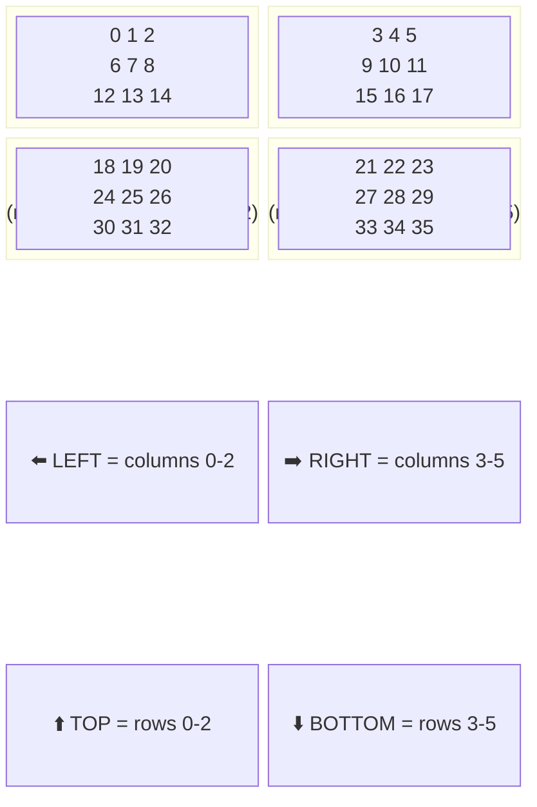
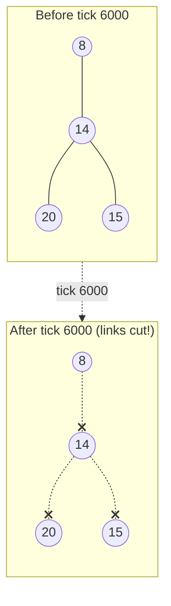
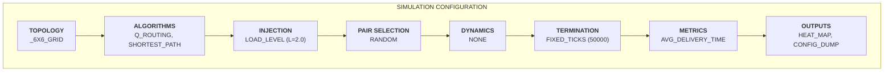
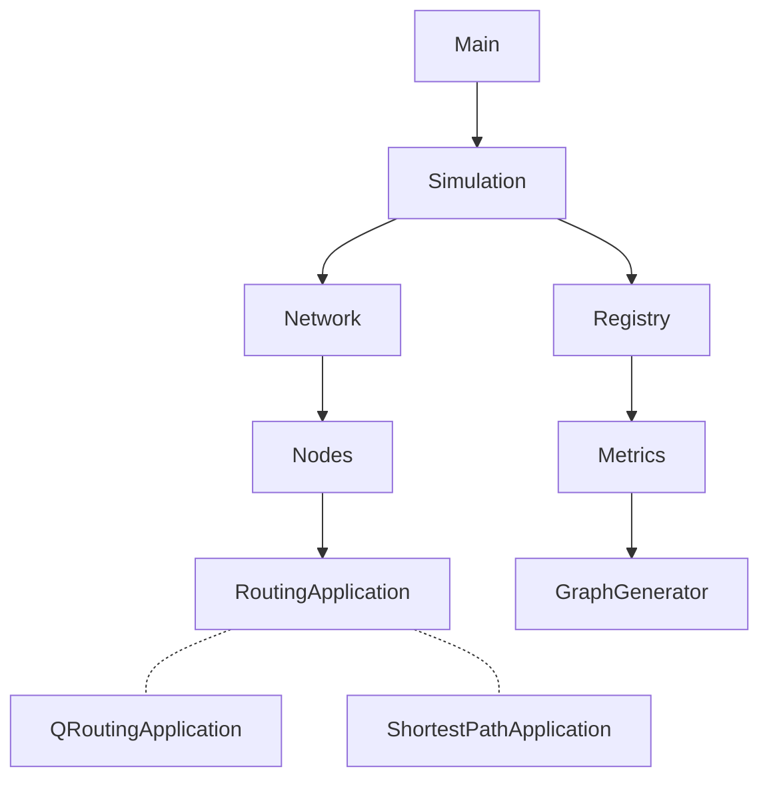

# Mesh Routing Framework

A simulation framework for comparing network routing algorithms (Q-Routing, Dijkstra's Shortest-Path, etc.) across different topologies and network conditions.


## Overview

This framework enables experimentation with adaptive routing algorithms in mesh networks. It implements a tick-based discrete event simulation that models packet queuing, transmission delays, and network congestion.

**Key features:**
- Compare multiple routing algorithms side-by-side
- Configurable network topologies (irregular grids, hypercubes, etc.)
- Flexible traffic injection schedules (load levels, windowed, ramp, triangular, etc.)
- Extensible metrics and visualization system

## Quick Start

**Prerequisites:** Java 21+, Maven 3.x

```bash
# Clone the repository
git clone https://github.com/yourusername/meshroutingframework.git
cd meshroutingframework

# Build
mvn clean package

# Run simulation
java -cp target/meshroutingframework-1.0-SNAPSHOT.jar org.ungs.cli.Main

# Or use the Makefile
make run
```

## Supported Algorithms

| Algorithm | Description |
|-----------|-------------|
| **Q-Routing** | Reinforcement learning approach that learns optimal routes by updating Q-values based on delivery feedback |
| **Shortest-Path** | Dijkstra's algorithm - computes static shortest paths from each node to all destinations |

## Configuration

All simulation parameters are defined in `src/main/resources/application.properties`.

### How the Simulation Works

The simulation runs in discrete **ticks**. Each tick:

1. New packets are injected into the network (origin → destination pairs)
2. Each node forwards one packet from its queue to a neighbor
3. Packets hop node-to-node until they reach their destination
4. Metrics are recorded (delivery times, queue lengths, etc.)



The framework runs the same simulation once per algorithm, allowing direct comparison under identical conditions.

---

### Quick Example Configuration

```properties
# Topology: _6X6_GRID, _7_HYPERCUBE, _116_NODE_LATA
topology=_6X6_GRID

# Algorithms to compare (runs one simulation per algorithm)
algorithms=Q_ROUTING,SHORTEST_PATH

# Traffic injection schedule
injection-schedule=LOAD_LEVEL
injection-schedule.load-level.L=0.5

# Termination policy
termination-policy=FIXED_TICKS
termination-policy.fixed-ticks.total-ticks=50000

# Metrics to collect
metrics=AVG_DELIVERY_TIME,AVG_DELIVERY_TIME_VS_LOAD_LEVEL_VS_TICK

# Outputs
outputs=HEAT_MAP,CONFIG_DUMP
```

---

### 1. General Settings

| Property | Description | Default |
|----------|-------------|---------|
| `seed` | RNG seed for reproducibility | `42` |
| `max-active-packets` | Cap on concurrent in-flight packets (backpressure) | unlimited |
| `warmup-ticks` | Ticks to exclude from metrics (transient phase) | `0` |
| `experiment-name` | Output folder name | auto-generated |
| `output-folder` | Results directory | `./results/` |

**Note:** Set `warmup-ticks` to exclude Q-Routing's initial learning phase from measurements.

---

### 2. Topology

Defines the network structure: nodes and their connections.



| Topology | Description |
|----------|-------------|
| `_6X6_GRID` | 36-node grid with 4-connectivity (above) |
| `_7_HYPERCUBE` | 128-node 7-dimensional hypercube *(TODO)* |
| `_116_NODE_LATA` | 116-node LATA telephone network *(TODO)* |
| `FILE` | Load from external file *(TODO)* |

---

### 3. Termination Policy

Controls when the simulation stops.

| Policy | Condition |
|--------|-----------|
| `FIXED_TICKS` | After N ticks |
| `TOTAL_PACKETS_DELIVERED` | After N packets delivered |
| `COMPOSITE` | Combine policies with AND/OR logic |

**Examples:**

```properties
# Stop after 50,000 ticks
termination-policy=FIXED_TICKS
termination-policy.fixed-ticks.total-ticks=50000

# Stop after delivering 100,000 packets
termination-policy=TOTAL_PACKETS_DELIVERED
termination-policy.packets-delivered.total-packets=100000

# Stop when EITHER 50,000 ticks pass OR 100,000 packets delivered (whichever comes first)
termination-policy=COMPOSITE
termination-policy.composite.mode=OR
termination-policy.composite.policies=FIXED_TICKS,TOTAL_PACKETS_DELIVERED
```

---

### 4. Injection Schedule

Controls the packet injection rate over time.

**Load Level (L):** Average packets injected per tick. Implementation: `floor(L) + Bernoulli(frac(L))`.

| Schedule | Description | Use Case |
|----------|-------------|----------|
| `LOAD_LEVEL` | Constant L | Steady-state analysis |
| `TRIANGULAR_LOAD_LEVEL` | L oscillates min→max→min | Adaptation testing |
| `LINEAR_LOAD_LEVEL` | L ramps min→max | Stress testing |
| `SEGMENTWISE_LOAD_LEVEL` | Custom piecewise pattern | Complex scenarios |
| `PROB_PER_TICK` | Bernoulli(p) per tick | Low traffic |
| `GAP` | Batch every N ticks | Bursty traffic |
| `WINDOWED_LOAD` | Three fixed phases | Multi-phase experiments |
| `PLATEAU_RAMP_PLATEAU` | Low→ramp→high | Congestion onset |

#### Schedule Parameters

**LOAD_LEVEL** (constant load)
```properties
injection-schedule=LOAD_LEVEL
injection-schedule.load-level.L=0.5   # Average 0.5 packets per tick
```

**TRIANGULAR_LOAD_LEVEL** (oscillating)


```properties
injection-schedule=TRIANGULAR_LOAD_LEVEL
injection-schedule.minL=0.5                          # Valley (minimum load)
injection-schedule.maxL=5.0                          # Peak (maximum load)
injection-schedule.load-level-change.period-ticks=10000  # Full up-then-down cycle
```

**LINEAR_LOAD_LEVEL** (ramp)


```properties
injection-schedule=LINEAR_LOAD_LEVEL
injection-schedule.minL=0.5                          # Starting load
injection-schedule.maxL=5.0                          # Ending load
injection-schedule.load-level-change.period-ticks=10000  # Time to reach max
```

**SEGMENTWISE_LOAD_LEVEL** (custom piecewise)

Example: `{{4000,1.5~5.5},{20000,5.5},{4000,5.5~1.8},{22000,1.8}}`


```properties
injection-schedule=SEGMENTWISE_LOAD_LEVEL
# Format: {{duration,load_or_ramp},...}
# - {4000,1.5~5.5} = 4000 ticks ramping from 1.5 to 5.5
# - {20000,5.5} = 20000 ticks at constant 5.5
injection-schedule.segmentwise.segments={{4000,1.5~5.5},{20000,5.5},{4000,5.5~1.8},{22000,1.8}}
```

**Other schedules:**

```properties
# PROB_PER_TICK: Bernoulli(0.3) per tick
injection-schedule=PROB_PER_TICK
injection-schedule.prob-per-tick.p=0.3

# GAP: batch of 2 every 5 ticks
injection-schedule=GAP
injection-schedule.gap.inject-every-n-ticks=5
injection-schedule.gap.batch-size=2

# WINDOWED_LOAD: phase A → B → C
injection-schedule=WINDOWED_LOAD
injection-schedule.windowed-load.phase-a.ticks=200
injection-schedule.windowed-load.phase-a.batch=2
injection-schedule.windowed-load.phase-b.ticks=800
injection-schedule.windowed-load.phase-b.batch=10
injection-schedule.windowed-load.phase-c.batch=0

# PLATEAU_RAMP_PLATEAU
injection-schedule=PLATEAU_RAMP_PLATEAU
injection-schedule.plateau-ramp-plateau.p1.ticks=200
injection-schedule.plateau-ramp-plateau.p1.inject-every-n-ticks=5
injection-schedule.plateau-ramp-plateau.p1.batch-size=2
injection-schedule.plateau-ramp-plateau.ramp.ticks=600
injection-schedule.plateau-ramp-plateau.ramp.start-batch-size=2
injection-schedule.plateau-ramp-plateau.ramp.max-batch-size=10
injection-schedule.plateau-ramp-plateau.p3.batch-size=10

# FIXED_LOAD_STEP: cycle through batch sizes
injection-schedule=FIXED_LOAD_STEP
injection-schedule.fixed-load-step.step-ticks=200
injection-schedule.fixed-load-step.batch-sizes=1,2,3,4,5,6,7
```

---

### 5. Pair Selection

Determines how origin/destination pairs are chosen for injected packets.



| Strategy | Description |
|----------|-------------|
| `RANDOM` | Uniform random selection from all nodes |
| `RANDOM_IN_GROUPS` | Origin from group A, destination from group B |
| `OSCILLATING_BETWEEN_GROUPS` | Alternates A→B and B→A every N ticks |

```properties
pair-selection=RANDOM

# Or: oscillating between groups
pair-selection=OSCILLATING_BETWEEN_GROUPS
pair-selection.oscillating.period-ticks=200        # Switch direction every 200 ticks
pair-selection.oscillating.groups.a=LEFT           # First group name
pair-selection.oscillating.groups.b=RIGHT          # Second group name
```

**Constraints:**
```properties
pair-selection.constraints.disallow-self=true      # origin ≠ destination
pair-selection.constraints.disallow-neighbor=true  # no trivial 1-hop routes
```

---

### 6. Node Groups

Named node subsets used by group-based pair selection strategies.



```properties
# Define which groups exist
groups=TOP,BOTTOM,LEFT,RIGHT

# Define which nodes belong to each group
groups.TOP.nodes=0,1,2,3,4,5,6,7,8,9,10,11,12,13,14,15,16,17
groups.BOTTOM.nodes=18,19,20,21,22,23,24,25,26,27,28,29,30,31,32,33,34,35
groups.LEFT.nodes=0,1,2,6,7,8,12,13,14,18,19,20,24,25,26,30,31,32
groups.RIGHT.nodes=3,4,5,9,10,11,15,16,17,21,22,23,27,28,29,33,34,35
```

---

### 7. Network Dynamics

Topology changes during simulation (link/node failures, mobility).

| Type | Description |
|------|-------------|
| `NONE` | Static topology (default) |
| `SCHEDULED_LINK_FAILURES` | Disconnect specified links at a given tick |
| `NODE_FAILURES` | Stochastic node failures *(WIP)* |
| `MOBILITY` | Dynamic node positions *(TODO)* |

**Scheduled Link Failures** (replicates Boyan & Littman 1994):



```properties
network-dynamics=SCHEDULED_LINK_FAILURES
network-dynamics.scheduled-link-failures.disconnect-at-tick=6000
network-dynamics.scheduled-link-failures.reconnect-at-tick=0      # 0 = never reconnect
network-dynamics.scheduled-link-failures.links=14-15,8-14,14-20   # Links to cut (node-node pairs)
```

---

### 8. Metrics

Performance measurements collected during simulation.

| Metric | Description |
|--------|-------------|
| `AVG_DELIVERY_TIME` | Mean packet delivery time (ticks) |
| `AVG_DELIVERY_TIME_VS_LOAD_LEVEL` | Delivery time as function of load |
| `AVG_DELIVERY_TIME_VS_LOAD_LEVEL_VS_TICK` | Time series of delivery time and load |
| `P95_DELIVERY_TIME` | 95th percentile latency *(TODO)* |
| `PACKETS_IN_FLIGHT` | Concurrent packet count *(TODO)* |
| `QUEUE_LENGTH` | Per-node queue depth *(TODO)* |

```properties
metrics=AVG_DELIVERY_TIME,AVG_DELIVERY_TIME_VS_LOAD_LEVEL_VS_TICK
```

---

### 9. Outputs

Generated visualizations and exports.

| Output | Description |
|--------|-------------|
| `HEAT_MAP` | Link utilization heatmap |
| `GIF_ROUTE` | Animated routing visualization |
| `ROUTE_FRAMES` | Individual PNG frames |
| `CONFIG_DUMP` | Configuration snapshot |

```properties
outputs=HEAT_MAP,CONFIG_DUMP

# How often to sample data for visualizations (every 10 ticks)
output.sample-every-ticks=10

# Optional: Only include hops from tick 30000 onwards in heatmap
output.heatmap.from-tick=30000
output.heatmap.to-tick=            # Empty = no upper limit
```

---

### Configuration Summary



**Complete Example:**

```properties
seed=42
topology=_6X6_GRID
algorithms=Q_ROUTING,SHORTEST_PATH

injection-schedule=LOAD_LEVEL
injection-schedule.load-level.L=2.0

pair-selection=RANDOM
network-dynamics=NONE

termination-policy=FIXED_TICKS
termination-policy.fixed-ticks.total-ticks=20000
warmup-ticks=5000

metrics=AVG_DELIVERY_TIME
outputs=HEAT_MAP,CONFIG_DUMP
```

## Architecture



### Core Components

- **SimulationEngine** - Manages the tick-based event loop, initializes network topology, and coordinates packet injection
- **Network** - Represents the topology with nodes and links
- **Node** - Maintains a packet queue and delegates routing decisions to its `RoutingApplication`
- **RoutingApplication** - Abstract base class for routing algorithms
- **Registry** - Singleton that logs all simulation events (sends, receives, queue states)
- **Metrics** - Computes statistics from Registry data (avg delivery time, etc.)
- **GraphGenerator** - Creates comparative visualizations (heatmaps, charts)

## Extending the Framework

### Adding a New Routing Algorithm

1. Create a class extending `RoutingApplication`
2. Implement `onTick()` with your routing logic
3. Add a new `AlgorithmType` enum value
4. Create a `RoutingApplicationPreset` and register it in `RoutingApplicationFactory`

```java
public class MyCustomApplication extends RoutingApplication {

    public MyCustomApplication(Node node) {
        super(node);
    }

    @Override
    public AlgorithmType getType() {
        return AlgorithmType.MY_CUSTOM;
    }

    @Override
    public void onTick(SimulationRuntimeContext ctx) {
        getNextPacket().ifPresent(packet -> {
            Node.Id nextHop = decideNextHop(packet);
            getNode().send(packet, nextHop);
        });
    }
}
```

### Adding New Metrics

Implement the `Metric` interface and register it with the metrics system.

## References

Based on the experiments from:
> Boyan, J. A., & Littman, M. L. (1994). *Packet Routing in Dynamically Changing Networks: A Reinforcement Learning Approach*
