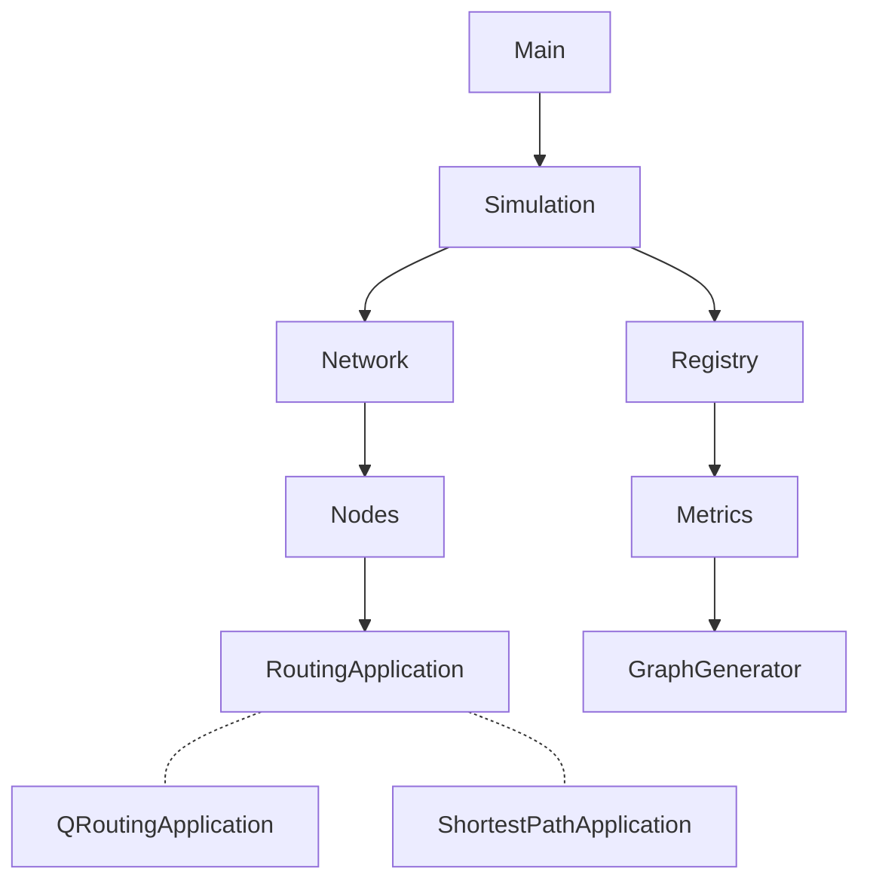

# Mesh Routing Framework

A simulation framework for comparing network routing algorithms (Q-Routing, Dijkstra's Shortest-Path, etc.) across different topologies and network conditions.


## Overview

This framework enables experimentation with adaptive routing algorithms in mesh networks. It implements a tick-based discrete event simulation that models packet queuing, transmission delays, and network congestion.

**Key features:**
- Compare multiple routing algorithms side-by-side
- Configurable network topologies (irregular grids, hypercubes, etc.)
- Flexible traffic injection schedules (load levels, windowed, ramp, triangular, etc.)
- Extensible metrics and visualization system

## Quick Start

**Prerequisites:** Java 21+, Maven 3.x

```bash
# Clone the repository
git clone https://github.com/yourusername/meshroutingframework.git
cd meshroutingframework

# Build
mvn clean package

# Run simulation
java -cp target/meshroutingframework-1.0-SNAPSHOT.jar org.ungs.cli.Main

# Or use the Makefile
make run
```

## Supported Algorithms

| Algorithm | Description |
|-----------|-------------|
| **Q-Routing** | Reinforcement learning approach that learns optimal routes by updating Q-values based on delivery feedback |
| **Shortest-Path** | Dijkstra's algorithm - computes static shortest paths from each node to all destinations |

## Configuration

All simulation parameters are defined in `src/main/resources/application.properties`:

```properties
# Topology: _6X6_GRID, _7_HYPERCUBE, _116_NODE_LATA
topology=_6X6_GRID

# Algorithms to compare (runs one simulation per algorithm)
algorithms=Q_ROUTING,SHORTEST_PATH

# Traffic injection schedule
injection-schedule=LOAD_LEVEL
injection-schedule.load-level.L=0.5

# Termination policy
termination-policy=FIXED_TICKS
termination-policy.fixed-ticks.total-ticks=50000

# Metrics to collect
metrics=AVG_DELIVERY_TIME,AVG_DELIVERY_TIME_VS_LOAD_LEVEL_VS_TICK

# Outputs
outputs=HEAT_MAP,CONFIG_DUMP
```

### Injection Schedules

| Schedule | Description |
|----------|-------------|
| `LOAD_LEVEL` | Constant average load L per tick |
| `TRIANGULAR_LOAD_LEVEL` | Load varies triangularly between min/max over a period |
| `LINEAR_LOAD_LEVEL` | Load varies linearly between min/max |
| `WINDOWED_LOAD` | Multiphase fixed batch sizes (A → B → C) |
| `PLATEAU_RAMP_PLATEAU` | Plateau → ramp → plateau pattern |
| `FIXED_LOAD_STEP` | Stepwise batch levels every N ticks |

## Architecture



### Core Components

- **SimulationEngine** - Manages the tick-based event loop, initializes network topology, and coordinates packet injection
- **Network** - Represents the topology with nodes and links
- **Node** - Maintains a packet queue and delegates routing decisions to its `RoutingApplication`
- **RoutingApplication** - Abstract base class for routing algorithms
- **Registry** - Singleton that logs all simulation events (sends, receives, queue states)
- **Metrics** - Computes statistics from Registry data (avg delivery time, etc.)
- **GraphGenerator** - Creates comparative visualizations (heatmaps, charts)

## Extending the Framework

### Adding a New Routing Algorithm

1. Create a class extending `RoutingApplication`
2. Implement `onTick()` with your routing logic
3. Add a new `AlgorithmType` enum value
4. Create a `RoutingApplicationPreset` and register it in `RoutingApplicationFactory`

```java
public class MyCustomApplication extends RoutingApplication {

    public MyCustomApplication(Node node) {
        super(node);
    }

    @Override
    public AlgorithmType getType() {
        return AlgorithmType.MY_CUSTOM;
    }

    @Override
    public void onTick(SimulationRuntimeContext ctx) {
        getNextPacket().ifPresent(packet -> {
            Node.Id nextHop = decideNextHop(packet);
            getNode().send(packet, nextHop);
        });
    }
}
```

### Adding New Metrics

Implement the `Metric` interface and register it with the metrics system.

## References

Based on the experiments from:
> Boyan, J. A., & Littman, M. L. (1994). *Packet Routing in Dynamically Changing Networks: A Reinforcement Learning Approach*
