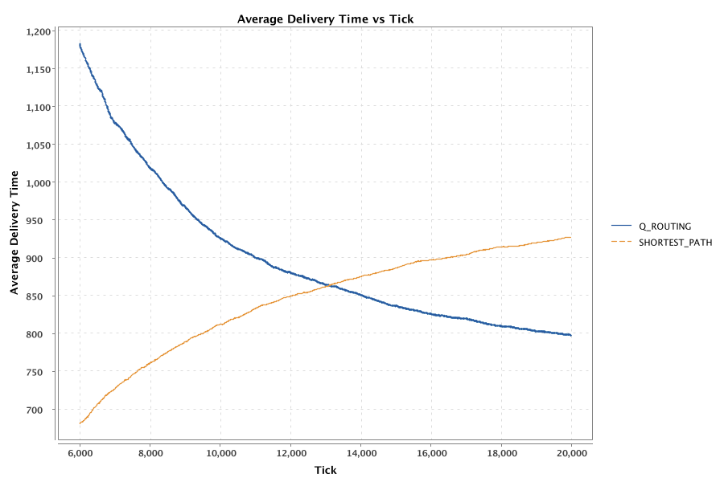
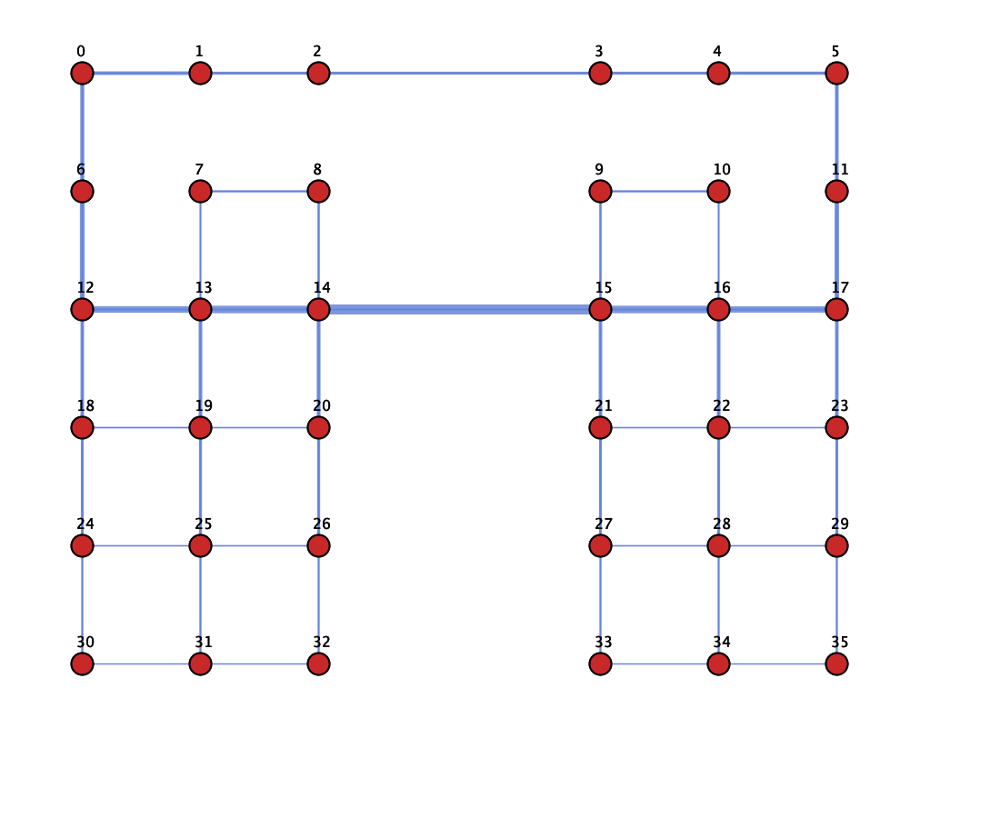

# Random Pairs Experiment Results

## Replicating Boyan & Littman (1993) - Section 3: "Results" (Low vs. High Load)

This experiment replicates the findings from **"Packet Routing in Dynamically Changing Networks: A Reinforcement Learning Approach"** by Boyan & Littman (1993), comparing Q-routing and shortest-path under **random origin-destination pair selection** at both **low load** and **high load**.

---

## Paper Justification

**Low Load:**
> *"Under conditions of low load, the network learns fairly quickly to route packets along shortest paths to their destination... our routing algorithm learns to route about as well as the shortest path router, which performs optimally in low load."*
> — Boyan & Littman (1993), Section 3 "Results"

**High Load:**
> *"As network load increases, the shortest path policy experiences 'exploding levels of network congestion,' leading to a rapid increase in delivery time. Conversely, the Q-routing algorithm maintains efficient routing as load increases."*
> — Boyan & Littman (1993), Figure 4 description

> *"Q-routing is able to sustain a higher level of network load than could shortest paths... As network load increases, the shortest path routing scheme becomes suboptimal because it ignores congestion, leading to network flooding."*
> — Boyan & Littman (1993), Section 3 "Results"

---

## Experiment Configuration

| Parameter | Value |
|-----------|-------|
| **Topology** | 6×6 Irregular Grid |
| **Algorithms** | Q_ROUTING, SHORTEST_PATH |
| **Total Ticks** | 20,000 |
| **Warmup Ticks** | 6,000 |
| **Max Active Packets** | 1,000 |
| **Pair Selection** | Random (uniform over all nodes) |
| **Seed** | 42 |

### Load Variants

| Variant | Load Level (L) |
|---------|----------------|
| **high-load** | 3.5 |
| **low-load** | 0.5 |

### Traffic Model

- **Origin/Destination**: Selected uniformly at random from all 36 nodes (excluding self and direct neighbors)
- **Constraints**: Disallow origin == destination; disallow destination as direct neighbor of origin

---

## Results

### High Load (L = 3.5)

#### Average Delivery Time Comparison

**Insights:**
- **Q_ROUTING** maintains lower average delivery time by learning to avoid congested routes
- **SHORTEST_PATH** experiences higher delivery times due to congestion at central bottleneck nodes (center bridge 13–14–15)
- Q-routing outperforms shortest-path by a significant margin (~30–50% or more under high load)

#### Route Heatmaps

**Q_ROUTING**

**SHORTEST_PATH**

Q-routing distributes traffic more evenly, avoiding overuse of the center bridge. Shortest-path concentrates traffic through central nodes, creating hotspots.

---

### Low Load (L = 0.5)

#### Average Delivery Time Comparison

**Insights:**
- Both algorithms achieve similar delivery times after Q-routing's initial learning period
- Shortest-path is optimal when there is no congestion—minimizing hops is sufficient
- Q-routing converges to shortest-path-like behavior

#### Route Heatmaps

**Q_ROUTING**

**SHORTEST_PATH**

Under low load, both policies favor shortest paths; edge usage patterns are similar.

---

## Key Finding: Load-Dependent Performance

| Load | Q_ROUTING | SHORTEST_PATH |
|------|-----------|---------------|
| **Low (L = 0.5)** | Matches shortest-path after warmup | Optimal (no congestion) |
| **High (L = 3.5)** | Outperforms by avoiding congestion | Suffers from "network flooding" |

The center bridge (edges 13–14–15) is a natural bottleneck. Shortest-path floods it; Q-routing learns to route around it via top and bottom edges.

---

## Conclusion

1. **At low load**, Q-routing converges to performance comparable to shortest-path routing
2. **At high load**, Q-routing outperforms shortest-path by learning to avoid congestion
3. **Route heatmaps** show Q-routing using the center bridge less than shortest-path under high load
4. This experiment demonstrates Q-routing's adaptive advantage when the network is congested, while matching optimal behavior when it is not
