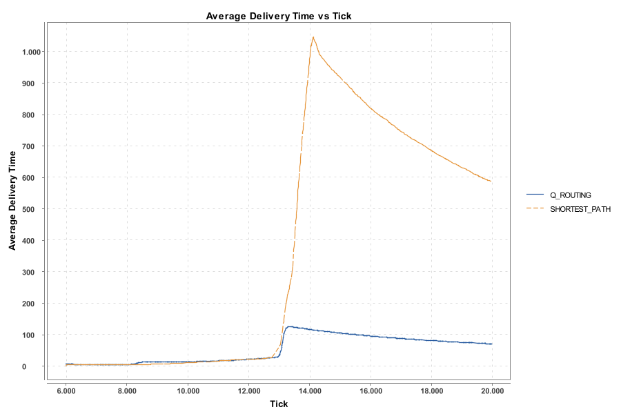
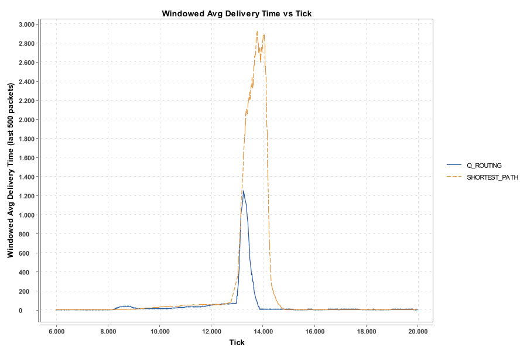
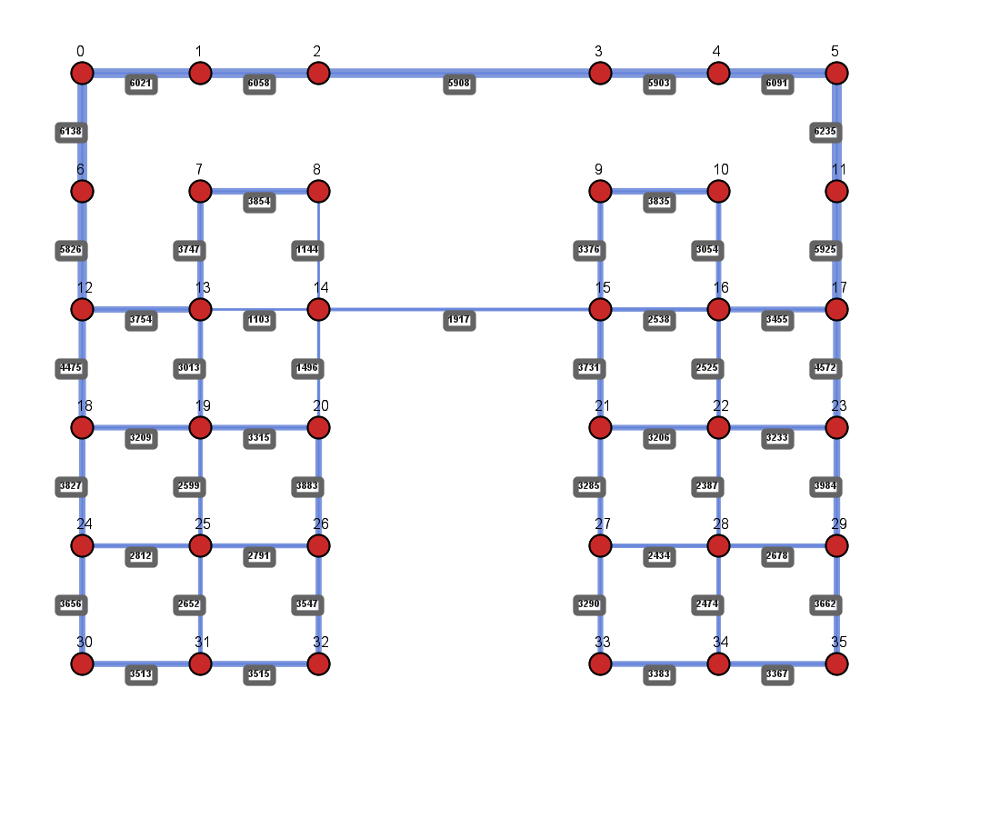
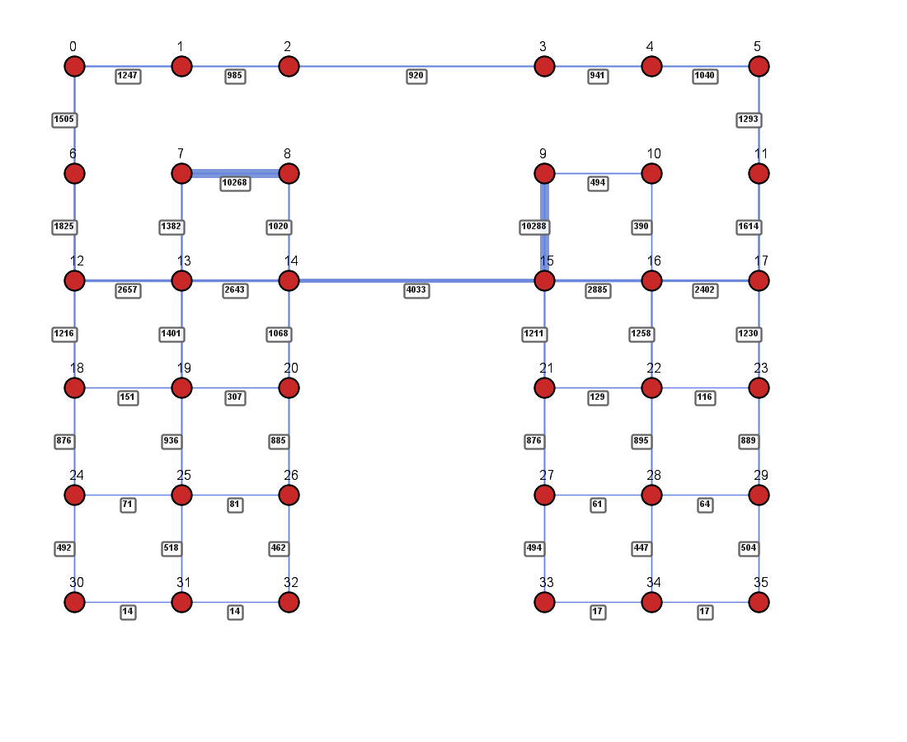
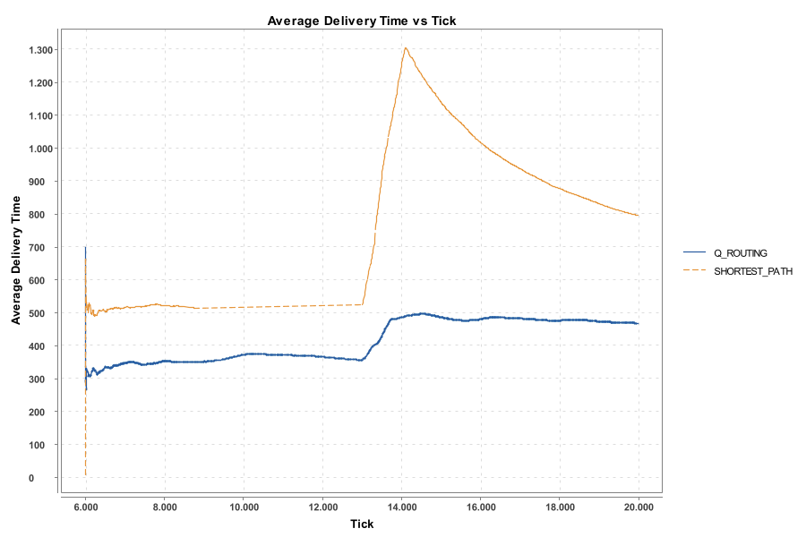
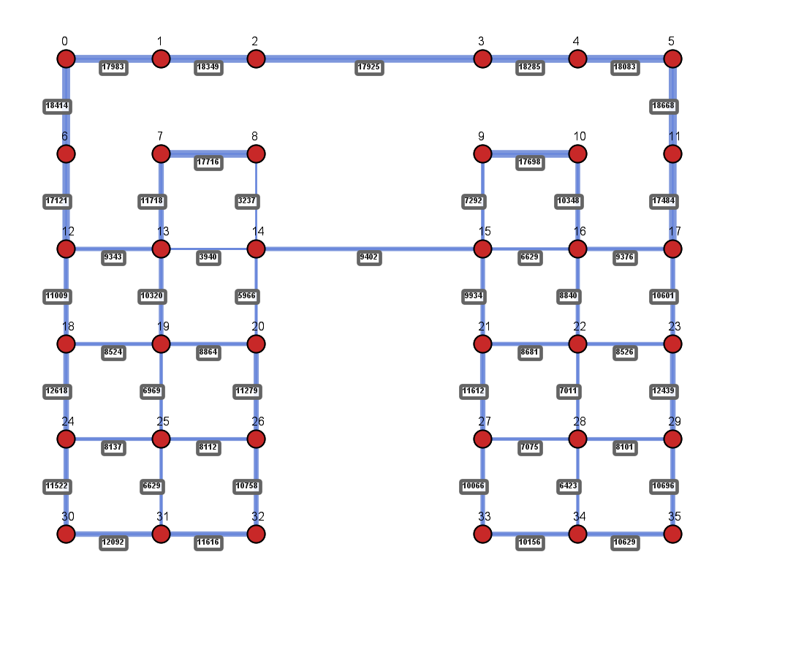
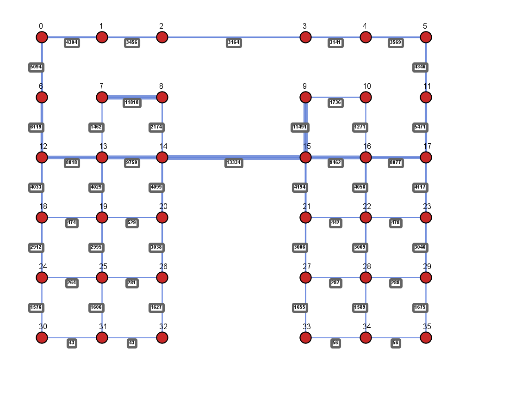

# Scheduled Link Failure Experiment Results

## Replicating Boyan & Littman (1993) - Section 3.1: "Topology" (Dynamic Network Changes)

This experiment replicates the findings from **"Packet Routing in Dynamically Changing Networks: A Reinforcement Learning Approach"** by Boyan & Littman (1993), specifically the behavior when **links are disconnected** from the network during simulation. Results are run under **high load** and **low load** to observe adaptation with and without congestion.

---

## Paper Justification

> *"**Topology**: We manually disconnected links from the network during simulation.
Qualitatively, Q-routing reacted quickly to such changes and was able to continue routing traffic efficiently."*
> — Boyan & Littman (1993), Section 3.1 "Dynamically Changing Networks"

---

## Experiment Configuration

| Parameter | Value |
|-----------|-------|
| **Topology** | 6×6 Irregular Grid |
| **Algorithms** | Q_ROUTING, SHORTEST_PATH |
| **Total Ticks** | 20,000 |
| **Warmup Ticks** | 6,000 |
| **Max Active Packets** | 1,000 |
| **Pair Selection** | Random |
| **Seed** | 42 |

### Load Variants

| Variant | Load Level (L) |
|---------|----------------|
| **high_load** | 3.5 |
| **low_load** | 0.5 |

### Scheduled Link Disconnections (Both Variants)

| Parameter | Value |
|-----------|-------|
| **Disconnect at Tick** | 8,000 |
| **Reconnect at Tick** | 13,000 |
| **Outage Window** | 5,000 ticks (8,000 → 13,000) |
| **Failed Links** | 13↔14, 14↔15, 8↔14, 14↔20 |

The four links all involve **node 14**; their failure isolates the center bridge. Links reconnect at tick 13,000, allowing observation of recovery.

---

## Results

### High Load (L = 3.5)

#### Average Delivery Time Comparison

**Insights:**
- **Before disconnection (ticks 6,000 → 8,000):** Q_ROUTING maintains lower delivery times (~320–360) than SHORTEST_PATH (~500–520) due to congestion avoidance
- **During outage (ticks 8,000 → 13,000):** SHORTEST_PATH surges to ~1,300; Q_ROUTING spikes to ~500 and stabilizes
- **After reconnection:** Q_ROUTING adapts back; SHORTEST_PATH recovers more slowly (~800)

#### Windowed Delivery Time

#### Route Heatmaps

**Q_ROUTING**

**SHORTEST_PATH**

---

### Low Load (L = 0.5)

#### Average Delivery Time Comparison

**Insights:**
- **Before disconnection:** Both algorithms operate efficiently with similar, low delivery times
- **During outage:** SHORTEST_PATH surges to ~1,030; Q_ROUTING peaks at ~130 and recovers quickly to ~65–70
- **After reconnection:** Q_ROUTING stabilizes; SHORTEST_PATH remains elevated (~590)

#### Windowed Delivery Time

#### Route Heatmaps

**Q_ROUTING**

**SHORTEST_PATH**

---

## Key Finding: Q-Routing Resilience to Topology Change

> *"Q-routing reacted quickly to such changes and was able to continue routing traffic efficiently."*
> — Boyan & Littman (1993), Section 3.1 "Dynamically Changing Networks"

| Load | SHORTEST_PATH Peak | Q_ROUTING Peak | Q-Routing Recovery |
|------|--------------------|----------------|--------------------|
| **High** | ~1,300 | ~500 | Stabilizes ~480–490 |
| **Low** | ~1,030 | ~130 | Recovers to ~65–70 |

Q-routing adapts faster to both failure and reconnection in both load regimes. Under high load, the combination of congestion and topology change stresses both algorithms; Q-routing still shows smaller spikes and faster recovery.

---

## Conclusion

1. **Scheduled disconnection** (4 links, tick 8,000–13,000) replicates the paper's topology-change scenario
2. **Q-routing** adapts quickly through online learning—no external routing table updates required
3. **SHORTEST_PATH** suffers severe degradation and slower recovery in both high and low load
4. **Route heatmaps and policy summaries** (in subfolders) visualize traffic redistribution during the outage
