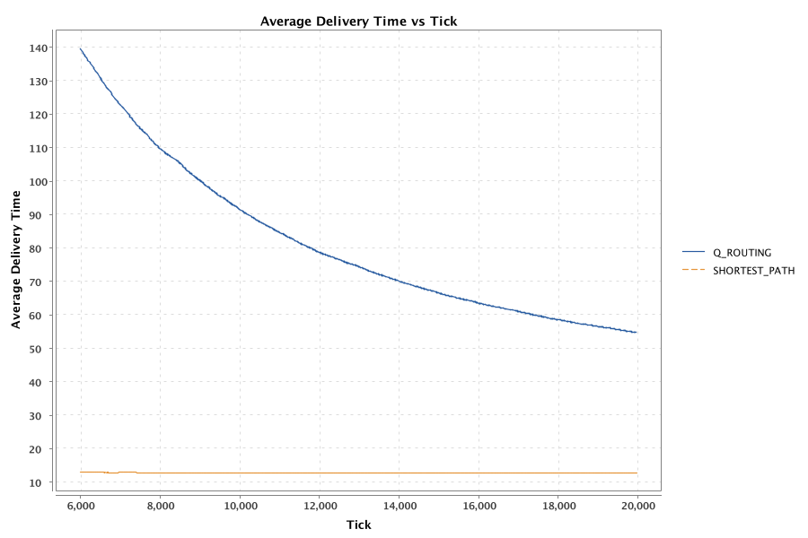
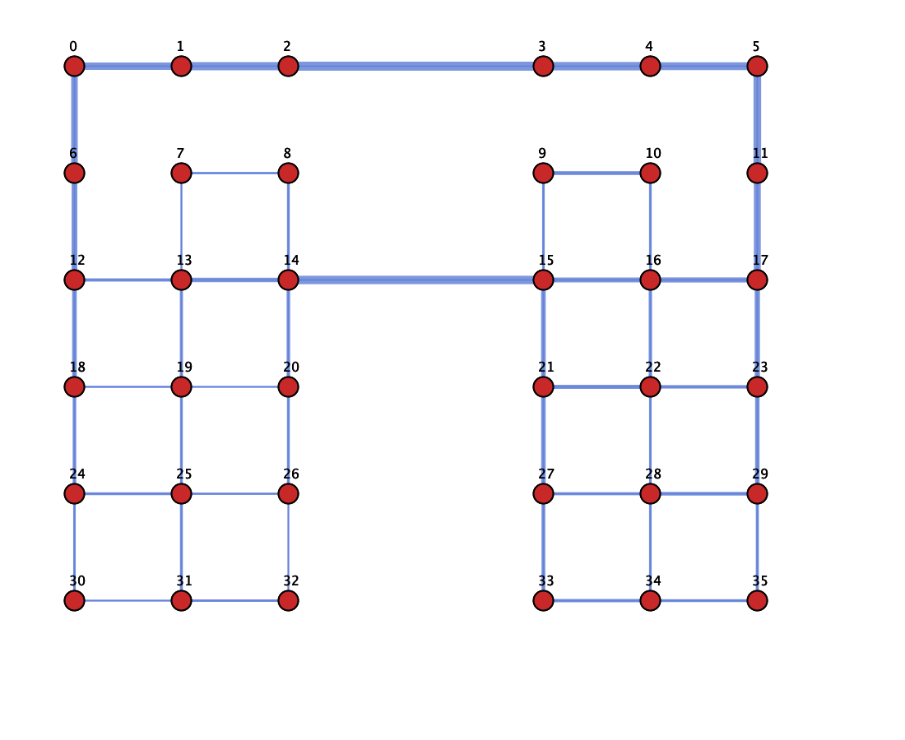
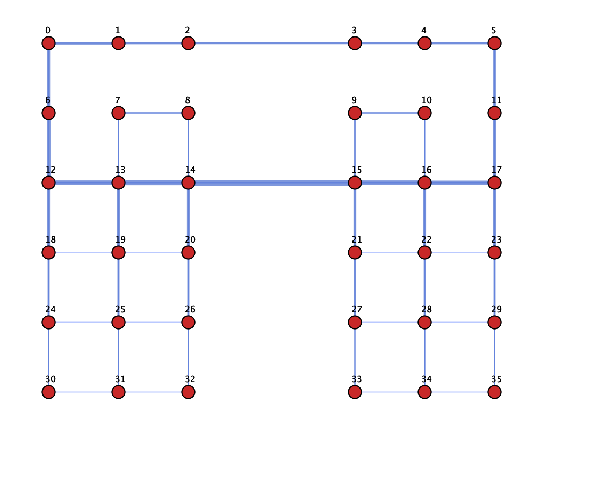

# Oscillating Traffic Patterns Experiment Results

## Replicating Boyan & Littman (1993) - Section 3.1: "Traffic Patterns"

This experiment replicates the findings from **"Packet Routing in Dynamically Changing Networks: A Reinforcement Learning Approach"** by Boyan & Littman (1993), specifically the behavior described in Section 3.1 regarding Q-routing's adaptation to **oscillating traffic patterns**.

---

## Paper Justification

> *"**Traffic patterns** We caused the simulation to oscillate periodically between two very different request patterns in the irregular grid: one in which all traffic was directed between the upper and lower halves of the network, and one in which all traffic was directed between the left and right halves. Again, after only a brief period of inefficient routing each time the request pattern switched, the Q-routing algorithm adapted successfully. > "*
> — Boyan & Littman (1993), Section 3.1 "Dynamically Changing Networks"

The paper states that Q-routing, unlike static routing policies, can adapt to changes in traffic patterns during operation. Learning algorithms "react quickly" to such changes and maintain efficient traffic routing.

---

## Experiment Configuration

| Parameter | Value |
|-----------|-------|
| **Topology** | 6×6 Irregular Grid |
| **Algorithms** | Q_ROUTING, SHORTEST_PATH |
| **Total Ticks** | 20,000 |
| **Warmup Ticks** | 6,000 |
| **Max Active Packets** | 1,000 |
| **Seed** | 42 |
| **Oscillation Period** | 200 ticks |

### Traffic Pattern Variants

Four sub-experiments combine two traffic directions with two load levels:

| Sub-Experiment | Traffic Direction | Load Level (L) |
|----------------|-------------------|----------------|
| **Left ↔ Right** | Origin in LEFT group, destination in RIGHT (and vice versa, alternating every 200 ticks) | Low (0.5) / High (3.5) |
| **Top ↔ Bottom** | Origin in TOP group, destination in BOTTOM (and vice versa, alternating every 200 ticks) | Low (0.5) / High (3.5) |

### Group Definitions (6×6 Grid)

- **TOP**: nodes 0–17 (top 3 rows)
- **BOTTOM**: nodes 18–35 (bottom 3 rows)
- **LEFT**: nodes 0,1,2, 6,7,8, 12,13,14, 18,19,20, 24,25,26, 30,31,32
- **RIGHT**: nodes 3,4,5, 9,10,11, 15,16,17, 21,22,23, 27,28,29, 33,34,35

---

## Results

### 1. Left-to-Right, Low Load (L = 0.5)

**Expected (per paper):** Under low load, both algorithms should perform similarly, as Q-routing learns to route along shortest paths.

---

### 2. Left-to-Right, High Load (L = 3.5)

**Expected (per paper):** Under high load, Q-routing should outperform shortest-path by learning to avoid congestion and distribute traffic across alternative routes (e.g., top and bottom edges of the grid).

---

### 3. Top-to-Bottom, Low Load (L = 0.5)

**Expected (per paper):** Similar to left-to-right low load—both algorithms converge to efficient shortest-path behavior.

---

### 4. Top-to-Bottom, High Load (L = 3.5)

**Expected (per paper):** Q-routing should adapt to the oscillating direction (TOP→BOTTOM vs BOTTOM→TOP) and avoid central bottlenecks under high load.

---

## Route Heatmaps

### Left-to-Right (High Load)

**Q_ROUTING**

**SHORTEST_PATH**

### Top-to-Bottom (High Load)

**Q_ROUTING**

**SHORTEST_PATH**

---

## Alignment with Paper

**Traffic patterns** were varied dynamically by oscillating between two group pairs (LEFT↔RIGHT and TOP↔BOTTOM) every 200 ticks.

**Q-routing** is expected to react quickly to these changes and maintain efficient routing, whereas shortest-path uses a fixed policy regardless of traffic direction.

---

## Conclusion

This experiment tests Q-routing's ability to adapt to **oscillating traffic patterns**—a key scenario from Boyan & Littman (1993). The four sub-experiments (two directions × two load levels) allow comparison of:

1. **Low load**: Both algorithms should perform similarly (shortest paths are optimal).
2. **High load**: Q-routing should outperform shortest-path by learning to avoid congestion and adapt to the changing traffic direction.
3. **Route heatmaps**: Visualize how Q-routing distributes traffic differently from shortest-path under oscillating demand.
