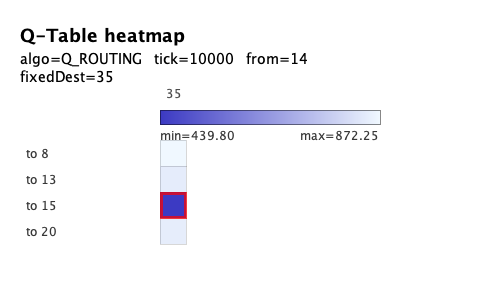
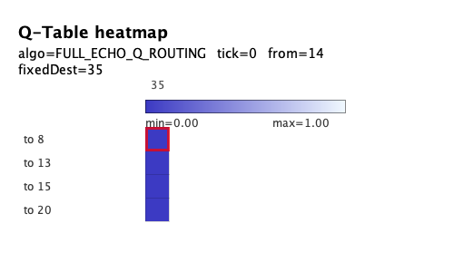
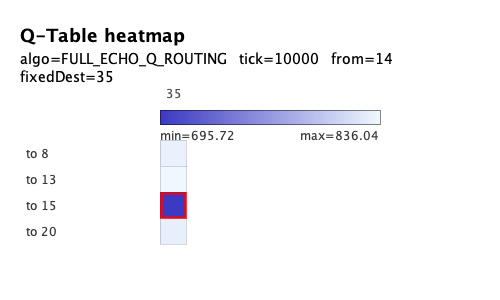
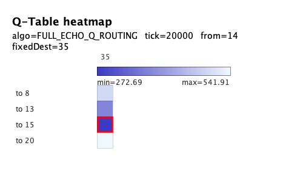
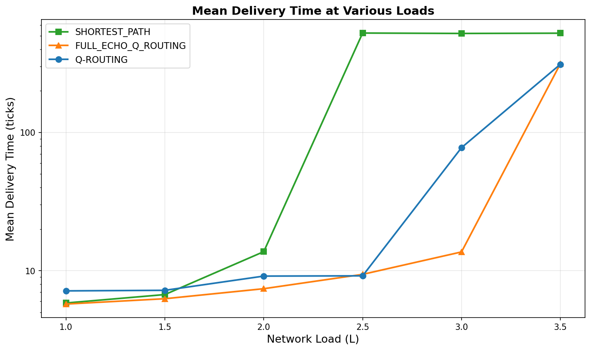
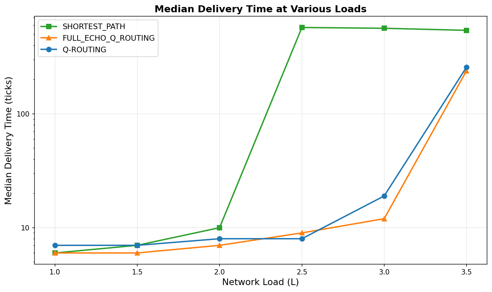
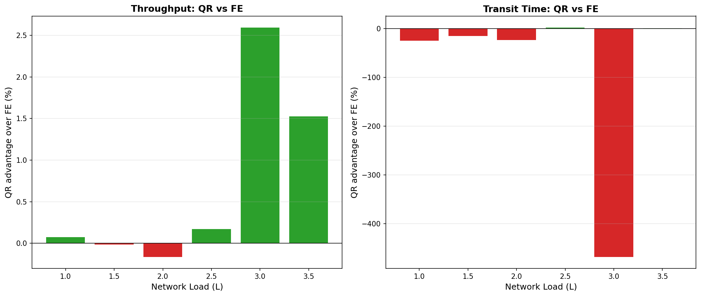
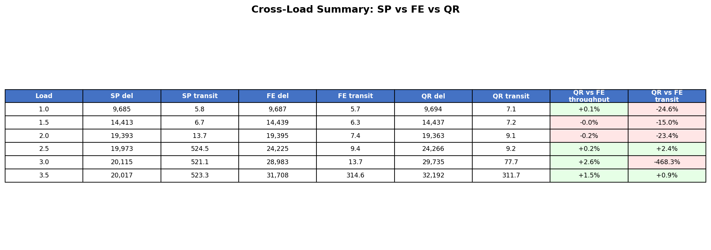
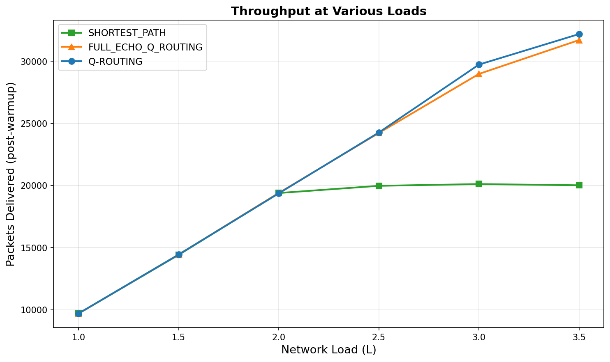

# Full-Echo Q-Routing Experiment Results

## Q-Routing Outperforms Full-Echo and Shortest Path Under High Load

This experiment compares **Q-routing**, **Full-Echo Q-routing**, and **Shortest Path** across low and high load conditions, replicating and extending the analysis from Boyan & Littman (1993), Section 3.2 "Exploration" and Figure 5.

---

## Paper Context

Boyan & Littman introduced **Full-Echo Q-routing** as a modification that sends information requests to immediate neighbors whenever a decision is needed, allowing Q-values for *all* neighbor–destination pairs to be updated—not only the selected action. This enables rapid propagation of shortcut information. The paper notes:

> *"Instead of sending actual packets in a random direction, a node using the "full echo" modification of Q-routing sends requests for information to its immediate neighbors every time it needs to make a decision. Each neighbor returns a single number-using a separate channel so as to not contribute to network congestion in our model-giving that node's current estimate of the total time to the destination. These estimates are used to adjust the Qad,y) values for each neighbor y.
When shortcuts appear, or if there are inefficiencies in the policy, this information propagates very quickly through the network and the policy adjusts accordingly.
> ... At low loads the performance of "full echo" Q-routing is indistinguishable from that of the shortest path policy, as all inefficiencies are purged. 
> Under high load conditions, "full echo" Q-routing outperforms shortest paths but the basic Q-routing algorithm does better still. Our analysis indicates that "full echo" Q-routing constantly changes policy under high load, oscillating between using the upper bottleneck and using the central bottleneck for the majority of cross-network traffic. This behavior is unstable and generally leads to worse routing times under high load
> "*
> — Boyan & Littman (1993), Section 3.2 "Exploration"

> *"Ironically, the 'drawback' of the basic Q-routing algorithm—that it does no exploration and no fine-tuning after initially learning a viable policy—actually leads to improved performance under high load conditions. We still know of no single algorithm which performs best under all load conditions."*
> — Boyan & Littman (1993), Section 3.2 "Exploration"

Full-Echo exhibits unstable behavior under high load, constantly oscillating between different bottlenecks for cross-network traffic.

---

## Experiment Configuration

| Parameter | Value |
|-----------|-------|
| **Topology** | 6×6 Irregular Grid |
| **Algorithms** | Q_ROUTING, FULL_ECHO_Q_ROUTING, SHORTEST_PATH |
| **Total Ticks** | 30,000 |
| **Warmup Ticks** | 6,000 |
| **Max Active Packets** | 1,000 |
| **Pair Selection** | Random |
| **Seed** | 42 |

### Load Variants

| Variant | Load Level (L) |
|---------|----------------|
| **high-load** | 3.5 |
| **low-load** | 0.5 |

---

## 1. Q-Table Heatmap Analysis: Policy Variability

An inspection of the Q-table heatmaps reveals that the **Full-Echo Q-routing** variant exhibits significantly **higher policy variability over time** when compared to standard Q-routing. For a fixed source node and destination, the identity of the neighbor minimizing \(Q_x(y,d)\) changes more frequently under Full-Echo, whereas the standard algorithm tends to settle early on a single preferred next hop and maintains that choice for long intervals.

This behavior is fully consistent with the qualitative description provided by Boyan and Littman: Full-Echo continuously updates and fine-tunes estimates for all neighbor–destination pairs, making it more sensitive to small fluctuations in estimated delivery times. In contrast, standard Q-routing effectively "freezes" its policy once a viable route is found, since non-selected actions are no longer updated. The observed increase in policy switching under Full-Echo therefore confirms that the algorithm is operating in the intended regime described in the original work, independently of any quantitative performance metrics.

### Q-Table Heatmaps Over Time (High Load)

**Standard Q-Routing** — policy stabilizes early and remains consistent:

  
*Tick 0*

  
*Tick 10,000*

  
*Tick 20,000*

**Full-Echo Q-Routing** — higher variability in preferred next-hop over time:

  
*Tick 0*

  
*Tick 10,000*

  
*Tick 20,000*

---

## 2. Cross-Load Analysis: Delivery Time vs. Load Level

To complement the qualitative observation, we conducted cross-run experiments following the methodology described in the original paper: for each load level \(L\), multiple independent simulations were executed and aggregate statistics were computed (mean and median delivery time across runs).

### Cross-Load Findings

The resulting cross-load analysis shows that:

- **At low load levels (L = 1.0–2.0)**, all three algorithms exhibit comparable performance.
- **As load increases beyond L = 2.5**, Shortest Path rapidly degrades due to congestion accumulation along static routes.
- **At higher load levels (L = 3.0 and L = 3.5)**, Q-routing achieves slightly lower mean and median delivery times than Full-Echo.
- In particular, at the highest tested load levels, **Q-routing consistently matches or outperforms Full-Echo** in aggregate delivery time, while also showing lower policy volatility. This suggests that, in this experimental setting, the additional sensitivity introduced by Full-Echo does not translate into a performance advantage under sustained high load. Instead, the relative stability of standard Q-routing appears to provide a modest but consistent benefit.

---

## Conclusion

Taken together, the heatmap analysis and cross-run aggregation indicate that:

1. **Full-Echo operates in the expected high-reactivity regime** — continuous updates lead to higher policy variability over time.
2. **Standard Q-routing converges toward stable routing policies** — it settles on a preferred next hop and maintains it for long intervals.
3. **Under high load, Q-routing slightly outperforms both Full-Echo and Shortest Path** in terms of delivery time.
4. **Increased update aggressiveness (Full-Echo) does not necessarily yield superior performance** in this configuration; the stability of standard Q-routing provides a modest but consistent benefit under sustained high load.

These findings align qualitatively with the adaptive behavior described in the original work, while quantitatively demonstrating that Q-routing outperforms Full-Echo and Shortest Path under high load in this experimental setting.
